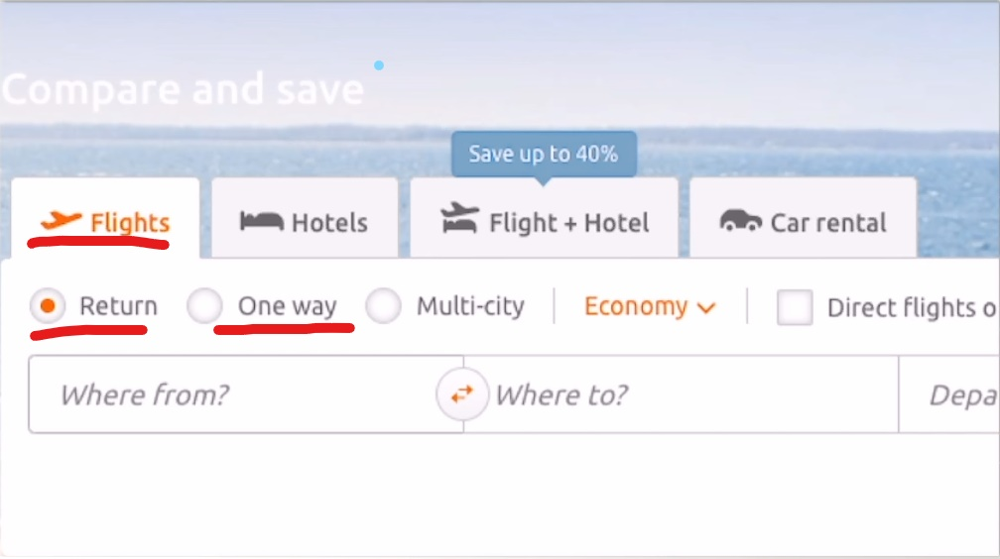

# Lesson 3

1. here

   ```
   come here
   过来

   Jack is here
   杰克在这里

   Is Jack here?
   杰克在这里吗?

   Hello, Tom! Is Jack here?
   你好，汤姆！杰克在这里吗？

   No, he isn't here
   不，他不在这里

   Yes, he's here
   是的，他在这里
   ```

2. `my`后面必须加名词，`my cat`、`my pen`、`my mother`

3. ticket

   ```
   one way ticket
   单程票

   return ticket
   往返票

   round trip ticket
   往返票
   ```

   

4. 当你想买去某地的票时，使用`one ticket to 某地`，当你想买去某地的往返票时，使用`one return ticket to 某地`

   ```
   one ticket to China
   一张去中国的票

   one ticket to Nanning
   一张去南宁的票

   one return ticket to New York
   一张去纽约的往返票
   ```

5. 当你做错一件非常严重的事需要道歉时，用`I'm so sorry`来表达更加强烈的抱歉

6. 名句

   ```
   Land on Mars, a round-trip ticket - half a million dollars. It can be done
   登陆火星，一张往返票 - 50万美元。这是可以做到的
   ```

## Sorry, sir

```
My coat and my umbrella, please. Here is my ticket

Thank you, sir. Number five

Here's your umbrella and your coat

This is not my umbrella. Sorry, sir

Is this your umbrella?

No, it isn't

Is this it?

Yes, it is

Thank you very much
```
