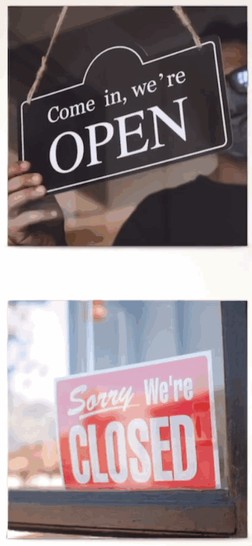

# Lesson 20

1. 在表示商店不营业的时候，通常用`close`多于`shut`

   ```
   We are closed
   我们关门了

   We are shut
   我们关门了
   ```

   

2. `Look at them`

   ```
   Look at them
   看他们
   // 根据“主谓宾”结构，`look at`是谓语，谓语后面跟着宾语，`they`的宾语形式是`them`
   ```

3. 名句

   ```
   You're never too old to start learning, and you're never too young to aim high and achieve great things
   你永远不会太老而不能开始学习，也永远不会太年轻而不能志存高远，成就伟业
   ```
