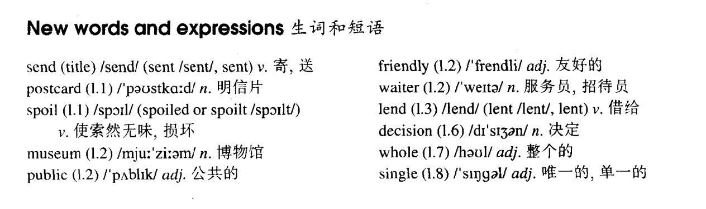

# Lesson 3

## Words

- send sent postcard spoil museum public friendly waiter lend lent decision whole single

- 

## Please send me a card

```
Postcard always spoil my holidays.

Last summer, I went to Italy. I visited museums and sat in public gardens.

A friendly waiter taught me a few words of Italian. Then he lent me a book.

I read a few lines, but I did not understand a word.

Every day I thought about postcards. My holidays passed quickly, but I did not send cards to my friends.

On the last day I made a big decision. I got up early and bought thirty seven cards.

I spent the whole day in my room, but I did not write a single card!
```

## Whole

1. `waiter`更多指的是男服务员，`waitress`指的是女服务员

2. `lend`借出，`borrow`借入

   ```
   I lent him a book

   I lent a book to him
   ```

   ```
   I borrowed a book

   I borrowed a book from him
   ```

3. `whole day` 一整天

   ```
   I spent the whole day to do it
   ```

4. `mind your own business` 管好你自己的事

   ```
   Why don't you mind your own business?
   ```

5. `She's single` 她是单身

6. `make a decision` 下定决心

7. `think about sth./sb.` 思考某事/某人。想某事/某人

   ```
   Every day I thought about my homework
   ```
