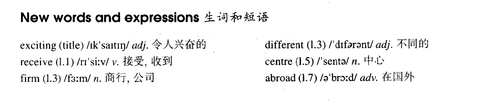

# Lesson 4

## Words

- exciting receive firm different centre abroad

- 

## An exciting trip

```
I have just received a letter from my brother, Tim. He is in Australia. He has been there for six months.

Tim is an engineer. He is working for a big firm and he has already visited a great number of different places in Australia.

He has just bought an Australian car and has gone to Alice Springs, a small town in the centre of Australia.

He will soon visit Darwin. From there, he will fly to Perth.

My brother has never been abroad before, so he is finding this trip very exciting.
```
