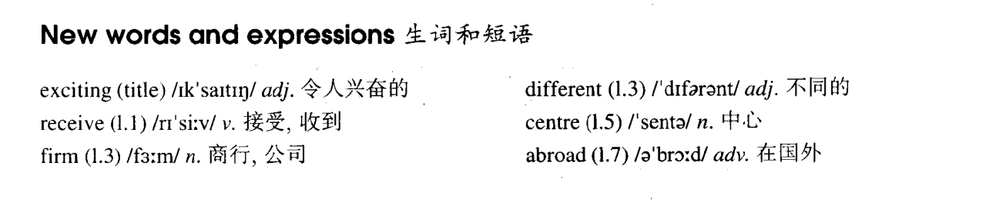

# Lesson 4

## Words

- exciting receive firm different centre abroad

- 

## An exciting trip

```
I have just received a letter from my brother, Tim. He is in Australia. He has been there for six months.

Tim is an engineer. He is working for a big firm and he has already visited a great number of different places in Australia.

He has just bought an Australian car and has gone to Alice Springs, a small town in the centre of Australia.

He will soon visit Darwin. From there, he will fly to Perth.

My brother has never been abroad before, so he is finding this trip very exciting.
```

## Expressions

1. `have a great trip` 旅途愉快

2. `A be different from B` 表示 A 和 B 不一样

   ```
   I am different from you
   我和你不同/我们不一样


   My glass is different from your glass
   我的杯子和你的不一样
   ```

3. `receive sth. from sb.` 收到某人的某物

   ```
   I received a red pocket from my mother last Chinese New Year
   去年春节我收到我妈妈的红包
   ```

4. `take a holiday` 度假

   ```
   He's already taken a holiday
   他已经度假了
   ```

5. `a great number of cn.` 大量的某物

   ```
   A great number of different places
   很多不同的地方
   ```

6. `find n. adj.` 认为什么事物/人怎么怎么样

   ```
   I finds the cat so cute
   我觉得这只猫很可爱

   He's finding the train very fast

   I found her very beautiful on the stage last night
   ```

## Whole

1. `现在完成时`表达的意思比较含蓄，而`一般过去式`表达的意思比较直接

   ```
   你想和我们一起吃晚饭吗？

   我刚吃过一点东西
   // `现在完成时`，潜台词就是“不用了，我吃过了”，拒绝别人的邀请

   我下午五点半时吃了顿饭
   // `一般过去时`，我吃过饭了，不吃了，拒绝别人的邀请
   ```

2. `现在完成时`和`一般过去时`并不是泾渭分明的，它们大多数时候可以互相替换

3. `He has been there for six months` 说这句话的时候`Tim`还在那里

4. `He is finding this trip very exciting` 可以替换为 `He finds this trip very exciting`。时态与时态之间并不是泾渭分明的，有时可以互相替换
