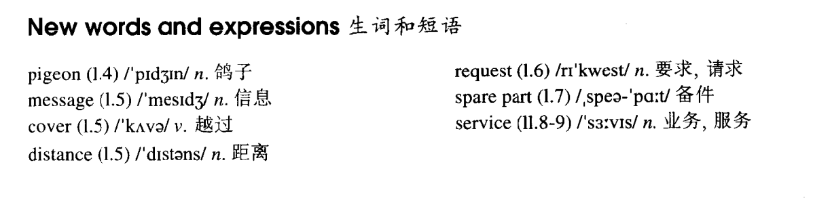

# Lesson 5

## Words

- pigeon message cover distance request spare part service

- 

## Expressions

-

## No wrong numbers

```
Mr. James Scott has a garage in Silbury and now he has just bought another garage in Pinhurst.

Pinhurst is only five miles from Silbury, but Mr. Scott cannot get a telephone for his new garage. So he has just bought twelve pigeons.

Yesterday, a pigeon carried the first message from Pinhurst to Silbury. The bird covered the distance in three minutes.

Up to now, Mr. Scott has sent a great many requests for spare parts and other urgent messages from one garage to the other.

In this way, he has begun his own private 'telephone' service.
```

## Expressions

1. `up to now` 迄今为止

2. `so far` 到目前为止

3. `spare part` 备用零件；备件

4. `leave sb. sth.` 留下某物

   ```
   I left him a message
   我给他留下了一条信息

   He's just left me some money
   ```

5. `cover the distance in st.` 花费了多长时间走过这段距离

   ```
   He covered the distance from the school in two hours
   ```

6. `send a request for sth.` 请求某物

   ```
   He's already sent a request for a new computer
   ```

7. `customer service` 顾客服务；客服

   ```
   She's in the customer service department, it's difficult work
   ```
