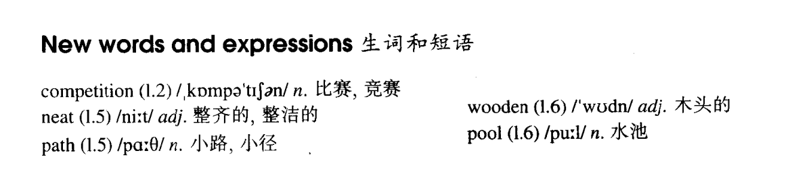

# Lesson 8

## Words

- competition neat path wooden pool

- 

## The best and the worst

```
Joe Sanders has the most beautiful garden in our town. Nearly everybody enters for 'The Nicest Garden Competition' each year, but Joe wins every time.

Bill Frith's garden is larger than Joe's. Bill works harder than Joe and grows more flowers and vegetables, but Joe's garden is more interesting.

He has made neat paths and has built a wooden bridge over a pool. I like gardens too, but I do not like hard work.

Every year I enter for the garden competition too, and I always win a little prize for the worst garden in the town!
```

## Expressions

1. `enter the competition` 参加比赛

   ```
   He enters the competition every year
   ```

2. `That's neat` 和 `That's cool` 表达意思相近，在这里`neat`不表示`整齐；整洁`

   ```
   有一件事很酷就可以用。如跳起来直接扣篮就可以

   That's neat!
   ```

3. `swimming pool` 游泳池

   ```
   The swimming pool is cleaned every day

   There are a great many swimming pools in this district
   ```
