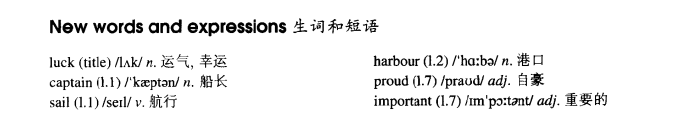

# Lesson 12

## Words

- luck captain sail harbour proud important

- 

## Goodbye and good luck

```
Our neighbor, Captain Charles Alison, will sail from Portsmouth tomorrow. We'll meet him at the harbour early in the morning.

He will be in his small boat, Topsail. Topsail is a famous little boat. It has sailed across the Atlantic many times.

Captain Alison will set out at eight o'clock, so we'll have plenty of time. We'll see his boat and then we'll say goodbye to him.

He will be away for two months. We are very proud of him. He will take part in an important race across the Atlantic.
```

## Whole

1. `set out` 启程；出发

   ```
   I will set out at 8 and fly to America

   He's just set out to school
   ```

2. `lucky dog` 幸运儿。外国人比较喜欢狗，所以用狗指代人

   ```
   You lucky dog
   ```

3. `be proud of sb.` 为某人感到骄傲

   ```
   The captain is very proud of me

   I won a prize for the best lawyer in New York and my parents are very proud fo me

   He's proud of you
   ```

4. `I would love to` 我很乐意

   ```
   Shall we dance?

   I would love to
   ```

5. `stay up` 熬夜

   ```
   You'd better not stay up often
   ```

6. `have plenty of time` 有足够多的时间

   ```
   We'll have plenty of time and we'll spend three days in France
   ```

7. `will be away` 将离开。因为 `away` 是 `adv.`，所以前面需要加 `be`

8. `take part in` 参加。和 `enter for` 差不多

   ```
   He refused to take part in the race

   She wistfully takes part in the 'Best Woman Competition' every year
   ```

9. `sail from sw.` 从某地出发航行

   ```
   He'll be sailing from the big port to another country
   ```

10. `say goodbye to sb.` 对某人说再见

    ```
    My parents asked me to say goodbye to him

    Come here and say goodbye to your aunt
    ```
