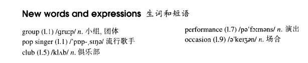

# Lesson 13

## Words

- group club performance occasion

- 

## The Greenwood Boys

```
The Greenwood Boys are a group of pop singers. At present, they are visiting all parts of the country. They will be arriving here tomorrow.

They will be coming by train and most of young people in the town will be meeting them at the station.

Tomorrow evening they will be singing at the Workers' Club. The Greenwood Boys will be staying for five days. During this time, They will give five performances.

As usual, the police have a difficult time. They will be trying to keep order. It is always the same on these occasions.
```

## Whole

1. `pop singer/music/star` 流行歌手/歌曲/明星。 `pop` 为 `popular` 的缩写

   ```
   The famous pop singer moved to our street yesterday
   ```

2. `a group of students/waiters/...` 一组学生/服务员/...

   ```
   Look, a group of detectives are keeping guard at the door
   ```

3. `join club` 加入俱乐部

   ```
   I've just joined the golf club

   ```

4. `performance` 本身是 `n.`，可以通过 `give` 来使它变成一个动词短语。和 `have a conversation` 类似

   ```
   They are giving a performance

   She was giving a performance while the police came in
   ```

5. `occasionally` 和 `sometimes` 类似

   ```
   They only meet occasionally
   ```
