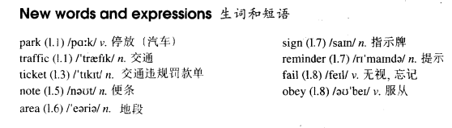

# Lesson 16

## Words

- park traffic ticket note area sign reminder fail obey

- 

## A polite request

```
If you park your car in the wrong place, a traffic policeman will soon find it. You will be very lucky if he lets you go without a ticket. However, this does not always happen. Traffic police are sometimes very polite.

During a holiday in Sweden, I found this note on my car: 'Sir, we welcome you to our city.'

'This is a "No Parking" area. You will enjoy your stay here if you pay attention to our street signs. This note is only a reminder.'

If you receive a request like this, you cannot fail to obey it!
```

## Whole

1. `parking lot` 停车场

   ```
   Is there a parking lot near here, sir?
   ```

2. `traffic police/lights/ticket` 交警/红绿灯/交通罚单

   ```
   Our son is a traffic police and we're very proud of him

   The traffic lights have been broken by the thief

   Don't park here, you'll get a traffic ticket for that
   ```

3. `heave traffic` 和 `traffic jam` 都表示车流量很大，交通拥堵

   - `traffic jam` 交通堵得像果酱似的

4. `make notes` 记笔记

   ```
   I believe you have made all notes in my class
   ```

5. `area` 和 `zone` 类似

   ```
   This is a 'No Parking' area

   This is a 'No Parking' zone
   ```

6. `remind sb. of sth./sb.` 使某人想起某事/某人

   ```
   He reminds me of my mother

   It's starting to remind me of you
   ```

7. `fail to do sth.` 没做成某件事

   ```
   He failed to borrow the car from his neighbor

   I've just failed to pass the Maths exam
   ```
