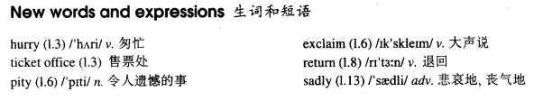

# Lesson 19

## Words

- hurry pity exclaim return sadly

- 

## Sold out

```
'The play may begin at any moment,' I said.

'It may have begun already,' Susan answered.

I hurried to the ticket office. 'May I have two tickets please?' I asked.

'I'm sorry, we've sold out,' the girl said.

'What a pity!' Susan exclaimed.

Just then, a man hurried to the ticket office.

'Can I return these two tickets?' he asked.

'Certainly,' the girl said.

I went back to the ticket office at once.

'Could I have those two tickets please?' I asked.

'Certainly,' the girl said. 'but they're for next Wednesday's performance. Do you still want them?'

'I might as well have them,' I said sadly.
```

## Whole

1. `ticket office` 售票处

   ```
   The ticket office must have been cleaned every day

   They must be cleaning that ticket office
   ```

2. `just then` 就在那时

3. `at once` 立刻；马上。和 `immediately` 类似

   ```
   After you told him that, he paid it back at once
   ```

4. `hurry to sw.` 匆忙赶去某地

   ```
   Why did she leave her phone? She must have hurried to school
   ```

5. `it's a pity that ...` 某件事很遗憾

   ```
   It's a pity that we can't afford it

   It's a pity that she didn't reply the letter
   ```

6. `don't yell at me` 别冲我大喊大叫

   ```
   Don't yell at me, sir. We don't make you late
   ```

7. `sold out` 售罄

8. `may as well` 要做一件事，但没有更好的选择了，只能凑合着选一个不太差的选择。

   ```
   我们要去吃火锅，但是去到商场发现其它好吃的火锅店都已经打烊，只有海底捞还营业着，但是海底捞我们几天前就已经吃过了。但因为好吃的火锅店全都打烊了，只能选择海底捞这个不太差的。类似于中文语境的`来都来了`

   If no one wants it, we might as well give it to him

   I might as well take part in the new play
   // 没有其它更好的话剧找我了，只好选择这个话剧团了
   ```
