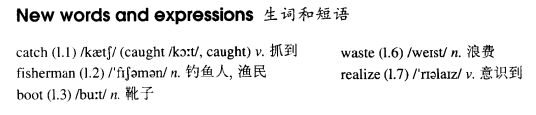

# Lesson 20

## Words

- catch fisherman boot waste realize

- 

## One man in a boat

```
Fishing is my favorite sport. I often fish for hours without catching anything. But this does not worry me.

Some fishermen are unlucky. Instead of catching fish, they catch old boots and rubbish. I am even less lucky. I never catch anything - not even old boots.

After having spent whole mornings on the river, I always go home with an empty bag. 'You must give up fishing!' my friend say. 'It's a waste of time.'

But they don't realize one important thing. I'm not really interested in fishing. I am only interested in sitting in a boat and doing nothing at all!
```
