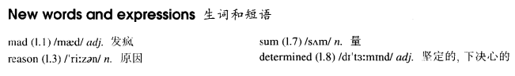

# Lesson 21

## Words

- mad sum reason determined

- 

## Mad or not?

```
Aeroplanes are slowly driving me mad. I live near an airport and passing planes can be heard night and day.

The airport was built years ago, but for some reason it could not be used then. Last year, however, it came into use.

Over a hundred people must have been driven away from their homes by the noise. I am one of the few people left. Sometimes I think this house will be knocked down by a passing plane.

I have been offered a large sum of money to go away, but I am determined to stay here. Everybody says I must be mad and they are probably right.
```

## Whole

1. `be mad at sb.` 对某人生气

   ```
   He was mad at her
   ```

2. `for some reason, ...` 出于某些原因...

   ```
   For some reason, he hurried to hospital

   For some reason, she is keen on fishing
   ```

3. `a large sum of sth.` 大量的...。和 `a lot of sth.` 类似

   ```
   A large sum of money was stolen last night
   ```

4. `be determined to do sth.` 下定决心做某事

   ```
   I'm determined to learn English better

   They're determined to take part in the play
   ```
