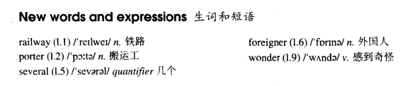

# Lesson 25

## Words

- railway porter several foreigner wonder

- 

## Do the English speak English?

```
I arrived in London at last. The railway station was big, black and dark. I did not know the way to my hotel, so I asked a porter.

I not only spoke English very carefully, but very clearly as well. The porter, however, could not understand me.

I repeated my question several times and at last he understood. He answered me, but he spoke neither slowly nor clearly.

'I am a foreigner,' I said. Then he spoke slowly, but I could not understand him. My teacher never spoke English like that!

The porter and I looked at each other and smiled. Then he said something and I understood it. 'You'll soon learn English!' he said.

I wonder. In England, each person speaks a different language. The English understand each other, but I don't understand them! Do they speak English?
```

## Questions

1. `I not only spoke English very carefully` 的 `I not only`，为什么可以接 `not`?

2. `but he spoke neither slowly nor clearly` 的 `nor`

## Whole

1. `no wonder` 怪不得

   ```
   No wonder you're stupid
   难怪你是笨蛋
   ```

2. `conj.` 并列连词

   - 用于连接两个句子或单词

   - 常见的有:

     - `and`, `but`, `or`, `so`

       - 同一主语情况下，主语不必重复

       ```
       He finished lunch, he went into the garden

       He finished lunch and went into the garden


       Jack speaks French, his wife speaks English

       Jack speaks French but his wife speaks English
       ```

     - `both...and`, `either...or`, `neither...nor`

       - `both...and` A 和 B 都...

       - `both...and` 通常用在肯定句

       ```
       Both my wife and I are going to Paris
       // `my wife` 为A，`I` 为B

       He can both sing and dance
       // 能唱也能跳舞

       I can speak both English and German
       // 会讲英语也会讲德语


       He teaches English, he teaches French, too

       He teaches both English and French
       ```

       - `either...or` 要么 A 要么 B

       ```
       Either the teacher or the students are wrong
       // 要么是 `the teacher`，要么是 `the students`
       // 之所以用 `are` 是因为在这里有就近原则，前面的为 `the students` 是复数，所以用 `are`

       When the girl is happy, she either sings or dances
       // 要么 `sing`，要么 `dance`

       I want either this red one or that green one
       // 要么 `red one`，要么 `green one`
       ```

       - `neither...nor` 既不 A 也不 B

       ```
       Neither dad nor mum isn't at home today
       // `dad` 和 `mum` 都不在家

       When the boy is sad, he neither sings nor dances
       // 既不想 `sing`，也不想 `dance`

       I want neither this one nor that one
       // 这也不想要，那也不想要


       He didn't speak slowly, he didn't speak clearly, either

       He spoke neither slowly nor clearly


       Mary didn't go to London, Jack didn't go to London, either

       Neither Mary nor Jack went to London
       ```

     - `not only...but also(as well)` 不仅...而且...

       - 存在感情上的递进关系

       ```
       Not only the doctor but also the patients don't know about it
       不仅仅医生不知道，而且病人也不知道
       // 医生不知道也就算了，病人也不知道。感情上有递进

       You must not only wash the dishes but sweep the floor as well
       // `but sweep the floor` 等于 `but also sweep the floor`

       He was not only a writer but also an actor
       ```

## Exercise

```
Either you or I can eat the biscuit

Yes, we can't both eat it
```

```
Either you or I can eat the cake

Yes, we can't both eat it
```

```
Either the man or you can buy the last cake

Yes, we can't both buy the last cake
```

```
Either you or she can use the ticket for the concert

Yes, you can't both use it for the concert
```

```
Either you or I can win the first prize

Yes, we can't both win it
```

```
Did either of them go to the film?
他们两个有去看电影吗？

No, neither of them went to it
不，他们两个谁都没去
```

```
Did either of them write him a letter?

No, neither of them wrote him a letter
```

```
Did either of them water the garden?

No, neither of them watered the garden
```

```
Did either of them sweep the room?

No, neither of them swept the room
```

```
Did either of them meet the president?

No, neither of them met the president
```
