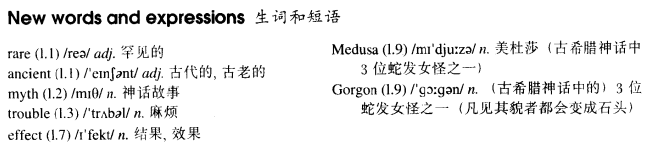

# Lesson 28

## Words

- rare ancient myth trouble effect Medusa Gorgon

- 

## No parking

```
Jasper White is one of those rare people who believes in ancient myths.

He has just bought a new house in the city, but ever since he moved in, he has had trouble with cars and their owners.

When he returns home at night, he always finds that someone has parked a car outside his gate. Because of this, he has not been able to get his own car into his garage even once.

Jasper has put up 'No Parking' signs outside his gate, but these have not had any effect.

Now he has put an ugly stone head over the gate. It is one of the ugliest faces I have ever seen. I asked him what it was and he told me that it was Medusa, the Gorgon.

Jasper hopes that she will turn cars and their owners to stone. But none of them has been turned to stone yet!
```

## Whole

1. `have trouble with sth.` 在某方面有麻烦

   ```
   When I was still in school, I had trouble with math

   You will have trouble with your teacher if you are late
   ```

2. `have trouble doing sth.` 做某事有麻烦

   ```
   The man who saved money for years had trouble finding his bank card
   ```

3. `so far` 到目前为止

   ```
   I have had no car so far
   ```

4. `ever since` 自从。和 `since` 用法一致

   ```
   He's lived here since 1990

   He's lived here ever since 1990
   ```

5. `stone head` 石像

6. `even once` 哪怕一次

7. `gate` & `door`

   - `gate` 通常是大铁门。类似于学校的铁门

   - `door` 通常是房间的门。

8. `whose` 引导的定语从句

   - `whose` 用来指代 `谁的`

   ```
   We saw some people, their car had broken down
   我们看见一些人，他们的车坏了

   We saw some people whose car had broken down
   我们见到的那些人的车坏了
   // `whose` 指代了 `their`


   I met a man, his wife is an English teacher

   I met a man whose wife is an English teacher


   I met somebody, his parents work in a bank

   I met somebody whose parents work in a bank
   ```

## Exercise

```
He's an ugly man, isn't he?

Yes, he's one of the ugliest men I've ever seen
```

```
It's a dull book, isn't it?

Yes, it's one of the dullest books I've ever read
```

```
It's a bad photo, isn't it?

Yes, it's one of the worst photos I've ever taken
```

```
It's a smart coat, isn't it?

Yes, it's one of the smartest coats I've ever worn
```

```
It's a fast car, isn't it?

Yes, it's one of the fastest cars I've ever driven
```

```
What an ugly man!

Yes, I've never seen such an ugly man before!
```

```
What a silly story!

Yes, I've never read such a silly story before!
```

```
What a high note!

Yes, I've never sung such a high note before!
```

```
What a bad luck!

Yes, I've never had such a bad luck before!
```

```
What a fresh milk!

Yes, I've never drunk such a fresh milk before!
```

```
How long have you known him?

I've known him since childhood
```

```
How long have you owned a bicycle?

I've owner it for six months
```

```
How long have you worked here?

I've worked here for a week
```

```
How long have you studied the violin?

I've studied it for two years
```

```
How long have you been a doctor?

I've been a doctor since 1989
```

```
How many times have you seen that film?

I've seen it three times so far
```

```
How many times have you given that speech?

I've given it three times so far
```

```
How many times have you written to diary?

I've written to it three times so far
```

```
How many times have you worn that dress?

I've worn it three times so far
```

```
How many times have you taken the exams?

I've taken them three times so far
```
