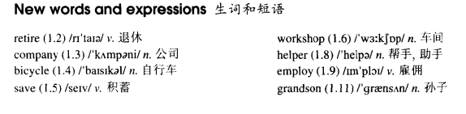

# Lesson 31

## Words

- retire company bicycle save workshop helper employ grandson

- 

## Success Story

```
Yesterday afternoon Frank Hawkins was telling me about his experiences as a young man.

Before he retired, Frank was the head of a very large business company, but as a boy he used to work in a small shop. It was his job to repair bicycles and at that time he used to work fourteen hours a day.

He saved money for years and in 1958 he bought a small workshop of his own. In his twenties Frank used to make spare parts for aeroplanes. At that time he had two helpers.

In a few years the small workshop had become a large factory which employed seven hundred and twenty-eight people.

Frank smiled when he remembered his hard early years and the long road to success. He was still smiling when the door opened and his wife came in. She wanted him to repair their grandson's bicycle!
```

## Questions

1. `used to`

## Whole

1. `fire` 表示 `辞退，解雇`

   ```
   The helper who I fired last year works for a big company now
   ```

2. `employee` 雇员。 `employer` 雇主

3. `save sb's life` 救了某人一命

4. `not...any more` 不再...

   ```
   I used to smoke, but I do not smoke any more
   我过去常常抽烟，但现在不再抽了

   I used to be a cop, but I'm not a cop any more
   ```

5. `not...any longer` 不再...。和 `not...any more` 类似

6. `used to do` 过去经常发生，现在基本已经不发生了。

   - `use` 不要单独翻译，和 `have to` 一样当作一个短语翻译

   ```
   I used to play basketball
   我以前经常打篮球
   // 至少包含两个意思：1. 我以前经常打篮球 2. 现在基本不打篮球了

   He used to cook everyday

   I used to be cute as a kid

   I don't drink beer now, but I used to drink it
   ```

   - 否定句

     ```
     I didn't use to play basketball

     He didn't use to cook everyday

     I didn't use to be cute as a kid
     ```

   - 一般疑问句

     ```
     Did you use to play basketball?

     Did he use to cook everyday?

     Did you use to be cute as a kid?
     ```
