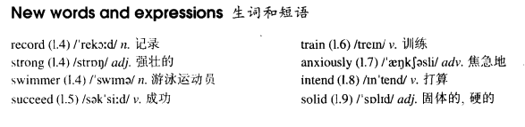

# Lesson 36

## Words

- record strong swimmer succeed train anxiously intend solid

- 

## Across the Channel

```
Debbie Hart is going to swim across the English Channel tomorrow. She is going to set out from the French coast at five o'clock in the morning.

Debbie is only eleven years old and she hopes to set up a new world record. She is a strong swimmer and many people feel that she is sure to succeed.

Debbie's father will set out with her in a small boat. Mr. Hart has trained his daughter for years. Tomorrow he will be watching her anxiously as she swims the long distance to England.

Debbie intends to take short rests every two hours. She will have something to drink but she will not eat any solid food.

Most of Debbie's school friends will be waiting for her on the English coast. Among them will be Debbie's mother, who swam the Channel herself when she was a girl.
```

## Questions

1. `Among them will be Debbie's mother, who swam the Channel herself when she was a girl`?

2. `set up a new world record` 创造一个新的世界纪录?

3. `Tomorrow he will be watching her anxiously as she swims the long distance to England` 中的 `as` 理解成 `while`?
