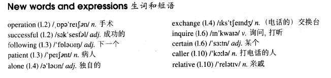

# Lesson 39

## Words

- operation successful following patient alone exchange inquire certain caller relative

- 

## Am I all right?

```
While John Gilbert was in hospital, he asked his doctor to tell him whether his operation had been successful, but the doctor refused to do so.

The following day, the patient asked for a bedside telephone. When he was alone, he telephoned the hospital exchange and asked for Doctor Millington.

When the doctor answered the phone, Mr. Gilbert said he was inquiring about a certain patient, a Mr. John Gilbert. He asked if Mr. Gilbert's operation had been successful and the doctor told him that it had been.

He then asked when Mr. Gilbert would be allowed to go home and the doctor told him that he would have to stay in hospital for another two weeks.

Then Dr. Millington asked the caller if he was a relative of the patient. 'No,' the patient answered, 'I'm Mr. John Gilbert.'
```

## Whole

1. `the following day` 和 `the next day` 类似

   ```
   She set up a new world record the following day
   ```

2. `live alone` 独居

   ```
   The man who lives alone got a surprise this morning
   ```

3. `leave me alone` 别管我；让我一个人待着

4. `currency exchange` 货币兑换处。出国时兑换货币的地方

5. `inquire about sth./sb.` 询问某事或某人

   ```
   I inquired about Jack and was told that he doesn't live here anymore
   ```

6. `front desk` 前台

   ```
   You will have to inquire about it at the front desk
   ```

7. `difficult` 用来形容人的时候，通常表示这个人很难相处

   ```
   This caller is as difficult as last one
   ```

8. `refuse to do so` 拒绝这样做

   ```
   He refused to do so each time.
   ```

## Exercises

```
I wonder if she's sold the house

I asked if she'd sold it, but no one knew
```

```
I wonder if he's had a operation

I asked if he'd had it, but on one knew
```

```
I wonder if he's posted the parcel

I asked if he'd posted it, but no one knew
```

```
I wonder if he's sold the car

I asked if he'd sold it, but no one knew
```

```
I wonder if she's had lunch

I asked if she'd had it, but on one knew
```

```
Has Mary met John?

Did Mary say she'd met John?

She didn't tell me whether she had or not
```

```
Has Jack seen that film?

Did Jack say he'd seen that film?

He didn't tell whether he had or not
```

```
Have the Smiths sold the flat?

Did the Smiths say they'd sold the flat?

They didn't tell me whether they had or not
```

```
Have the children eaten?

Did the children say they'd eaten?

They didn't tell me whether they had or not
```

```
Has your secretary lost my letter?

Did your secretary say she'd lost my letter?

She didn't tell me whether she had or not
```

```
Will they come tomorrow?

They didn't tell me when they'd come
```

```
Will they go abroad next week?

They didn't tell me when they'd gone abroad
```

```
Will she arrive this evening?

She didn't tell me when she'd arrived
```

```
Will he go to hospital tomorrow?

He didn't tell me when he'd gone to hospital
```

```
Will he settle down next year?

He didn't tell me when he'd settled down
```

```
Why didn't Tom come to the party?

Our teacher asked why Tom didn't come to the party. Do you know why?

I've no idea why he didn't come
```

```
Why didn't Jack attend the lecture?

Our teacher asked why Jack didn't attend the lecture. Do you know why?

I've no idea why he didn't attend
```

```
Why didn't Mary pay attention during the class?

Our teacher asked why Mary didn't pay attention. Do you know why?

I've no idea why she didn't pay attention
```

```
Why didn't Jack pay in the match?

Our teacher asked why Jack didn't pay in the match. Do you know why?

I've no idea why he didn't pay in
```

```
Why didn't that boy understand the question?

Our teacher asked why that boy didn't understand the question. Do you know why?

I've no idea why he didn't understand
```
