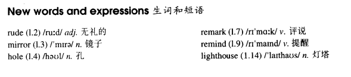

# Lesson 41

## Words

- rude mirror hole remark remind lighthouse modiste

- 

## Do you call that a hat?

```
'Do you call that a hat?' I said to my wife.

'You needn't be so rude about it,' my wife answered as she looked at herself in the mirror.

I sat down on one of those modern chairs with holes in it and waited. We had been in the hat shop for half an hour and my wife was still in front of mirror.

'We mustn't buy things we don't need,' I remarked suddenly. I regretted saying it almost at once.

'You needn't have said that,' my wife answered. 'I needn't remind you of that terrible tie you bought yesterday.'

'I find it beautiful,' I said. 'A man can never have too many ties.'

'And a woman can't have too many hats,' she answered.

Ten minutes later we walked out of the shop together. My wife was wearing a hat that looked like a lighthouse!
```

## Questions

1. `You needn't be so rude about it` 的 `needn't`，表示 `不需要`?

2. `My wife was wearing a hat that looked like a lighthouse!` 的 `that`

3. `A man can never have too many ties` 表示 `永不能没有` 还是 `永不能有`
