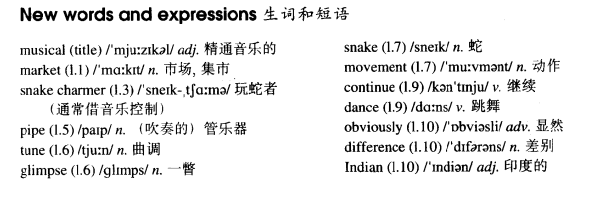

# Lesson 42

## Words

- musical market pipe tune glimpse snake movement continue dance obviously difference India charmer

- 

## Not very musical

```
As we had had a long walk through one of the markets of Old Delhi, we stopped at a square to have a rest.

After a time, we noticed a snake charmer with two large baskets at the other side of the square, so we went to have a look at him.

As soon as he saw us, he picked up a long pipe which was covered with coins and opened one of the baskets.

When he began to play a tune, we had our first glimpse of the snake. It rose out of the basket and began to follow the movements of the pipe.

We were very much surprised when the snake charmer suddenly began to play jazz and modern pop songs.

The snake, however, continued to 'dance' slowly. It obviously could not tell the difference between Indian music and jazz!
```

## Questions

1. `tell the difference`

2. 如何表达 `观看音乐剧`

3. 如何表达 `演奏一曲`

4. 如何表达 `瞥见`

## Whole

1. `snake charmer` 玩蛇者（通常借音乐控制）

2. `musical` 常见的名词意思 `音乐剧`。 `watch a musical` 看音乐剧

   ```
   I regretted watching that musical last night
   ```

3. `play a tune` 演奏一曲

   ```
   By the age of seven he could play any tune he heard on the piano
   ```

4. `have a glimpse of sth./sb.` 瞥见某物或某人

   ```
   If you had a glimpse of her, you would know how beautiful she is
   ```

5. `continue to do sth.` 继续做某事

   ```
   They continued to put up the tent
   ```

6. `tell the difference between A and B` 分辨 A 和 B 的不同

   ```
   I couldn't tell the difference between these two singers

   It's too easy for my wife to tell the difference between our twin sons
   ```

7. `have a long walk` 走了很长的路

   ```
   We will be having a long walk tonight

   We needn't have had this long walk

   If I weren't tired, I would have a long walk yesterday
   Q: 这句话是对的吗？ 还是 `If I hadn't been tired, I would have had a long walk yesterday`
   ```

8. `at the other side of sw.` 在某地的另一边

   ```
   Look, she's standing at the other side of the market
   ```

## Exercises

```

```
