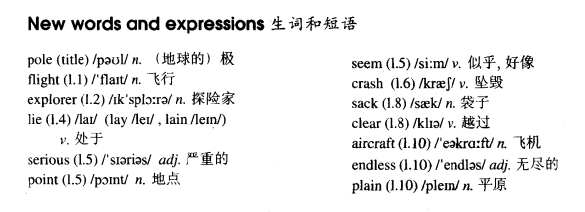

# Lesson 43

## Words

- pole flight explorer lie lay lain serious point seem crash sack clear aircraft endless plain difficulty foot feet

- 

## Over the South Pole

```
In 1929, three years after his flight over the North Pole, the American explorer, R. E. Byrd, successfully flew over the South Pole for the first time.

Though, at first, Byrd and his men were able to take a great many photographs of the mountains that lay below, they soon ran into serious trouble.

At one point, it seemed certain that their plane would crash. It could only get over the mountains if it rose to 10000 feet.

Byrd at once ordered his men to throw out two heavy food sacks. The plane was then able to rise and it cleared the mountains by 400 feet.

Byrd now knew that he would be able to reach the South Pole which was 300 miles away, for there were no more mountains in sight.

The aircraft was able to fly over the endless white plains without difficulty.
```

## Questions

1. `for there were no more mountains in sight` 的 `for` 表示 `因为`

2. `be able to do sth.` 有能力去做某事

3. `it seemed certain that their plane would crash` 看起来无疑是将坠毁

4. `by 400 feet` 仅仅高了 400 英尺

5. 如何表达 `赶飞机`

6. 如何表达 `遇到严重问题`

7. 如何表达 `在某一时间`

## Whole

1. `the South Pole` 南极。 `the North Pole` 北极

   ```
   If you moved to the South Pole, you could see the penguins everyday

   He's gone to the North Pole

   He's been to the North Pole
   ```

2. `catch a flight` 赶飞机

   ```
   I have to catch flight
   ```

3. `How was your flight?` 刚刚的飞行旅途还好吗？

4. `well known` 很有名的

   ```
   The mountain that lie below is very well known
   ```

5. `run into serious trouble` 遇到严重问题

   ```
   If I ran into serious trouble, I would call the cops

   You must give up that, or you will run into serious trouble
   ```

6. `serious` 形容人的时候，往往表示 `认真的；严肃的`

   ```
   Are you serious?
   // 兄弟，你认真的？

   Are you kidding?
   // 你开玩笑呢？
   ```

7. `It seems that...` 看起来...

   ```
   It seems that he couldn't tell the difference between his bottle and my bottle

   It seems that he's having a meeting
   ```

8. `at one point(time & place)` 在某一时间点/地点

   ```
   At one point in my life, I realized that I couldn't lose her

   At one point on my way to the theatre, my wallet was stolen
   ```
