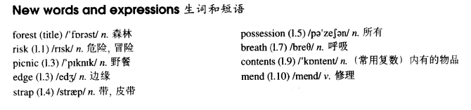

# Lesson 44

## Words

- forest risk picnic edge strap possession breath contents mend

- 

## Through the forest

```
Mrs. Anne Sterling did not think of the risk she was taking when she ran through a forest after two men.

They had rushed up to her while she was having a picnic at the edge of a forest with her children and tried to steal her handbag.

In the struggle, the strap broke and, with the bag in their possession, both men started running through the trees.

Mrs. Sterling got so angry that she ran after them. She was soon out of breath, but she continued to run.

When she caught up with them, she saw that they had sat down and were going through the contents of the bag, so she ran straight at them.

The men got such a fright that they dropped the bag and ran away. 'The strap needs mending,' said Mrs. Sterling later, 'but they did not steal anything.'
```

## Questions

1. `the strap broke and, with the bag in their possession`

2. `caught up with them` 赶上他们？

3. `were going through the contents of the bag` 越过包包里的东西？
