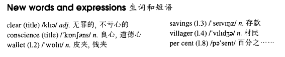

# Lesson 45

## Words

- clear conscience wallet savings villager per cent

- 

## A clear conscience

```
The whole village soon learnt that a large sum of money had been lost. Sam Benton, the local butcher, had lost his wallet while taking his savings to the post office.

Sam was sure that the wallet must have been found by one of the villagers, but it was not returned to him.

Three months passed, and then one morning, Sam found his wallet outside his front door.

It had been wrapped up in newspaper and it contained half the money he had lost, together with a note which said: 'A thief, yes, but only 50 per cent a thief!'

Two months later, some more money was sent to Sam with another note: 'Only 25 per cent a thief now!'

In time, all Sam's money was paid back in this way. The last note said: 'I am 100 per cent honest now!'
```

## Questions

1. `a large sum of money had been lost` 不是被动语态。 `钱遗失了`

2. `only 50 per cent a thief` 只有 50%的小偷属性？

3. `In time` 最后？

## Whole

1. `per cent` 百分之...
