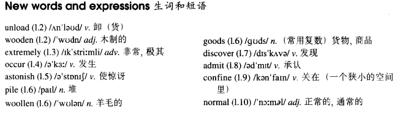

# Lesson 46

## Words

- unload wooden extremely occur astonish pile woollen goods discover admit confine normal

- 

## Expensive and uncomfortable

```
When a plane from London arrived at Sydney airport, workers began to unload a number of wooden boxes which contained clothing.

No one could account for the fact that one of the boxes was extremely heavy. It suddenly occurred to one of the workers to open up the box.

He was astonished at what he found. A man was lying in the box on top of a pile of woollen goods.

He was so surprised at being discovered that he did not even try to run away. After he was arrested, the man admitted hiding in the box before the plane left London.

He had had a long and uncomfortable trip, for he had been confined to the wooden box for over eighteen hours.

The man was ordered to pay ￡3500 for the cost of the trip. The normal price of a ticket is ￡2000!
```

## Whole

1. `it occurred to sb. that...` 某人突然想到.../突然发生...。类似于 `suddenly happen`

   ```
   It occurred to me that I forgot your birthday.

   It occurred to him that he hadn't fed his cat who was at home.
   ```

2. `it occurred to sb. to do sth.` 某人突然想到去做某事

   ```
   It occurred to him to feed his cat.
   ```

3. `be astonished at sth.` 被某事震惊到。类似于 `was surprised`、`was shocked`

   ```
   In New York, visitors are astonished at tall buildings.

   I was astonished at his new car.
   ```

4. `a pile of woods/books/questions` 一堆木材/书本/问题

   ```
   I've got a pile of questions.

   The captain ordered his men to throw a pile of woods out of the ship.
   ```

5. `sth./sb. be confined to sw.` 某人/某物被限制在某个地方

   ```
   He was confined to the kitchen for an hour.
   ```

6. `account for` 解释。类似于 `explain`

   ```
   Nobody can explain why he didn't come.

   Nobody can account for why he didn't come.
   // 和上一句一致
   ```

7. `sb. admit that...` 某人承认...

   ```
   The thief admitted that he'd stolen the wallet yesterday.
   ```

8. `admit doing sth.` 承认做某事

   ```
   The thief admitted stealing the wallet this morning.
   ```

9. 为什么是 `admit doing sth.` 而不是 `admit to do sth.`。自己的猜测如下

   - 猜测可能是 `admit to do sth.` 是 `承认去做某事`，而 `承认` 后面通常都是 `已经做了的事，而不是去做的事`

   - `admit doing sth.` 是 `承认做某事`，这件事不需要 `去`，也就是 `to`

10. M: `同位语从句`

    - 同位语：补充说明名词

    - 汉语中的同位语

      ```
      这是中国的首都，北京
      // `中国的首都`，`北京` 互为同位语，它们指的都是一个东西，只是给 `中国的首都` 这个名词再补充说明 `首都的名字叫北京`

      这是杰克，我的英语老师
      // `杰克`，`我的英语老师` 互为同位语

      我告诉你一个事实，小明昨晚偷偷溜出去网吧通宵
      // `一个事实`，`小明昨晚偷偷溜出去网吧通宵` 互为同位语，`小明昨晚偷偷溜出去网吧通宵` 就是 `一个事实` 的内容，讲的都是一件事

      科学家发现一个规律，哈雷彗星大约每隔76年造访一次地球
      // `哈雷彗星大约每隔76年造访一次地球` 就是 `一个规律` 所要说明的内容
      ```

      - 同位语从句：一个（完整的）句子补充说明一个名词

      - 定语从句是 `形容名词` 的，而同位语从句是 `解释名词`

        ```
        I want to tell you the fact which I heard yesterday.
        // 定语从句，形容名词
        // 我昨天听到的事实

        I want to tell you the fact that Jack gets up early everyday.
        // 同位语从句，解释名词，补充说明名词
        // `事实` 就是 `杰克每天早起`
        ```

11. M: `what` 被用来作为某些句子的简写

    - 这个语法最常用于 `what` 放在句首

    - `what` = `the thing that` 或者 `the person that`

      ```
      She is not the person that she used to be.

      She is not what she used to be.
      她不是她曾经想要去成为的人
      // 和上一句一致
      // `what` 替代了 `the person that`


      Show me the thing that you have written.

      Show me what you have written.
      给我看看你刚刚写的东西
      // `what` 替代了 `the thing that`


      He was astonished at the thing that he found.

      He was astonished at what he found.


      This is not what I meant.
      这不是我想表达的
      ```
