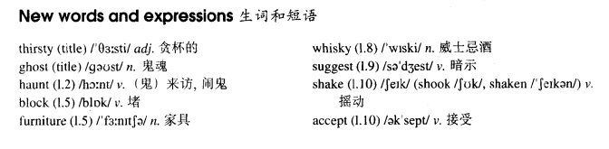

# Lesson 47

## Words

- thirsty ghost haunt block furniture whisky suggest shake shook shaken accept

- 

## A thirsty ghost

```
A public house which was recently bought by Mr. lan Thompson is up for sale. Mr. Thompson is going to sell it because it is haunted.

He told me that he could not go to sleep one night because he heard a strange noise coming from the bar.

The next morning, he found that the doors had been blocked by chairs and the furniture had been moved.

Though Mr. Thompson had turned the lights off before he went to bed, they were on in the morning.

He also said that he had found five empty whisky bottles which the ghost must have drunk the night before.

When I suggested that some villagers must have come in for a free drink, Mr. Thompson shook his head.

The villagers have told him that they will not accept the pub even if he gives it away.
```

## Questions

1. Q: 什么叫 `宾语补主语`

## Whole

1. `shake his head` 摇头

   ```
   Don't shake his head, it might hurt him.
   ```

2. `a public house` 和 `pub` 都说的一个地方，酒吧

3. `be up for sale` 待售，可以购买

   ```
   If a property or company is up for sale, its owner is trying to sell it.

   They're up for sale if you want them.
   ```

4. `the night before` 之前的晚上，昨晚

5. `give sth. away` 送出某物

   ```
   He hasn't given the precious gift away yet.
   ```

6. `hear sb. doing sth.` 听到某人在做某事（没有从头听到尾，只是听到正在进行的事）

   ```
   I heard them talking.
   // 只是听到了在对话

   I could hear it raining.
   // 最终什么时候雨停不知道，我只是听到在下雨
   ```

7. `hear sb. do sth.` 听到某人做某事（从头听到尾，听完了全程）

   ```
   I heard them talk.
   // 听完了整个对话

   I heard them go out.
   // 从他们开始收拾行李到出门，一直听直到一个动作结束
   ```
