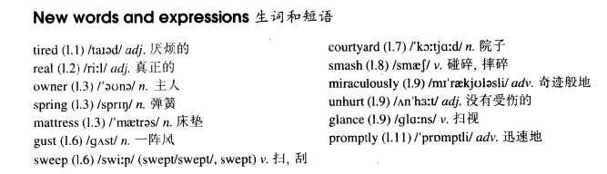

# Lesson 49

## Words

- tired real owner spring mattress gust sweep courtyard smash miraculously unhurt glance promptly

- 

## The end of the dream

```
Tired of sleeping on the floor, a young man in Teheran saved up for years to buy a real bed.

For the first time in his life, he became the proud owner of a bed which had springs and a mattress.

Because the weather was very hot, he carried the bed on to the roof of his house.

He slept very well for the first two nights, but on the third night, a storm blew up. A gust of wind swept the bed off the roof and sent it crashing into the courtyard below.

The young man did not wake up until the bed had struck the ground. Although the bed was smashed to pieces, the man was miraculously unhurt.

When he woke up, he was still on the mattress. Glancing at the bits of wood and metal that lay around him, the man sadly picked up the mattress and carried it into his house.

After he had put it on the floor, he promptly went to sleep again.
```

## Questions

1. `metal that lay around him`

2. `sent it crashing into the courtyard below` 分词作宾语补主语

## Whole

1.  `get/be tired of sth./doing sth.` 厌倦某事/做某事

    ```
    She is tired of working late every night.

    I'm a little tired of pizza, can we get something else?

    We got tired of the country and we moved into the town.
    ```

2.  `smash sth. to pieces` 将某物砸成碎片

    ```
    They had a fight and he smashed the window to pieces.
    ```

3.  `glanced at the watch/menu/woman` 扫了一眼手表/菜单/女人

    ```
    He glanced at the beautiful woman and quickly looked away.

    He glanced at his watch.
    ```

4.  `sb. save up for years to buy sth.` 某人为了买某物存钱存了好多年

    ```
    The man saved up for years to buy the new car.
    ```

5.  `for the first time in sb.'s life` 某人人生当中的第一次

    ```
    For the first time in my life, I bought a new house with the money I had saved up for years.
    ```

6.  M: `状语从句`

    | 状从         | 常用连词                                                                       | 特殊连词                                                      |
    | ------------ | ------------------------------------------------------------------------------ | ------------------------------------------------------------- |
    | 时间状语从句 | when, while, as, before, after, as soon as, til, until                         | ever since, since, the moment, no sooner..than, hardly...when |
    | 地点状语从句 |                                                                                |                                                               |
    | 原因状语从句 | because, as, for, since                                                        |                                                               |
    | 目的状语从句 | so that, in order that, that...                                                | in order to, as as to                                         |
    | 结果状语从句 | so...that, such...that                                                         |                                                               |
    | 条件状语从句 | if, unless                                                                     |                                                               |
    | 让步状语从句 | although, though, even though, even if, no matter how..., whatever, whoever... |                                                               |
    | 比较状语从句 | as...as, than                                                                  |                                                               |
    | 方式状语从句 | as, like, as if, the way                                                       |                                                               |

7.  M: `分词作状语从句`

    - `doing` & `done`

      1. 前后主语一致

      2. 去掉状从主语 & 连词（可留）

      3. 从句 v.变分词

      4. `doing` 主动进行/主动一般

      5. `done` 被动完成/被动一般

      ```
      She felt tired. She went to bed early.
      // 简单句

      Because she felt tired, she went to bed early.
      // 复合句

      (Because) Feeling tired, she went to bed early.
      // 分词（doing & done）作状语
      // 两句话的主语都一致，都是 `she`
      // 去掉状从主语 `she`
      // 连词 `because` 可留可不留
      // 从句 `she felt tired` 的动词 `felt` 变成分词。根据句子判断，如果是主动，就变成 `doing`，如果是被动就变成 `done`
      // 三句话表达的意思一致

      She went to bed early feeling tired.
      // 两句话顺序可以更换


      He got down on one knee. He asked her to marry him.

      After he got down on one knee, he asked her to marry him.

      (After) Getting down on one knee, he asked her to marry him.


      He was rushing out of the room. He was knocked down by a car.

      As he was rushing out of the room, he was knocked down by a car.

      (As) Rushing out of the room, he was knocked down by a car.


      He took off his shoes. Jack walked into his house.

      After he took off his shoes, Jack walked into his house.

      Taking off his shoes, Jack walked into his house.
      // `he` 和 `Jack` 说的都是一个人，所以主语是一致的


      The city was destroyed during the war. The city has now been rebuilt.

      Although the city was destroyed during the war, it has now been rebuilt.

      Destroyed during the war, the city has now been rebuilt.


      The teacher came in. The teacher was followed by students.

      The teacher came in, followed by students.
      // 老师先进门，学生后进


      The teacher came in. The teacher followed the students.

      The teacher came in, following the students.
      // 学生先进门，老师后进


      The car had an accident, hitting the train.
      // 汽车撞火车

      The car had an accident, hit by a train.
      // 火车撞汽车
      ```

    - `having done`

      1. 前后主语一致

      2. 去掉状从主语 & 连词（可留）

      3. 从句 v.变分词

      4. 强调从句 v.发生在主句 v.之前

      ```
      He had completed the book. He had a holiday.

      After he had completed the book, he had a holiday.

      Having completed the book, he had a holiday.
      // 变成 `having done`， 强调从句 `after he had completed the book` 发生在 `he had a holiday` 之前

      After completing the book, he had a holiday.
      // 也可以直接变成 `doing`


      I had already seen it twice. I didn't want to see it again.

      Because I had already seen it twice, I didn't want to see it again.

      (Because) Having already seen it twice, I didn't want to see it again.
      ```

    - `not doing`

      1. 前后主语一致

      2. 去掉状从主语 & 连词（可留）

      3. 从句 v.变分词

      4. `not` + 分词

      ```
      I did not want to wake her. I left the house silently.

      As I did not want to wake her, I left the house silently.

      Not wanting to wake her, I left the house silently.
      // `not` + 分词


      I didn't expect anyone to be in the house. I walked straight in.

      Because I didn't expect anyone to be in the house, I walked straight in.

      Not expecting anyone to be in the house, I walked straight in.


      I didn't know what to do. I asked him for help.

      As I didn't know what to do, I asked him for help.

      Not knowing what to do, I asked him for help.
      ```

    - `be adj. n.`

      1. 前后主语一致

      2. 去掉状从主语 & 连词（可留）

      3. 从句 v.变分词

      ```
      My girlfriend is a doctor. She knows what medicine you should take.

      Because my girlfriend is a doctor, she knows what medicine you should take.

      Being a doctor, she knows what medicine you should take.
      // `is` 的现在分词为 `being`

      A doctor, she knows what medicine you should take.
      // 这四句话表达意思一致


      They were excited. They played video games.

      Being excited, they played video games.

      Excited, they played video games.
      ```

## Exercises

Q: 以下五句是否正确

```
Were you reading a dull book last night?

Yes, I was. I fell asleep reading it.
```

```
Were you writing the report last night?

Yes, I was. I worked late writing it.
```

```
Were you waiting for speak to them last night?

Yes, I was. I got very angry worry waiting for them.
```

```
Were you thinking about Mary last night?

Yes, I was. I stayed awake thinking about her.
```

```
Were you looking for the photos last night?

Yes, I was. I spent ages looking for them.
```

```
I see you've bought a new pen.

Yes, I saved up for weeks to buy it.
```

```
I see you've passed the exam.

Yes, I worked hard to pass it.
```

```
I see you've got a new car.

Yes, I borrowed some money to get it.
```

```
I see you've found the book.

Yes, I searched all day to find it.
```

```
I see you've had a bath.

Yes, I got up early to have it.
```

```
Why did he miss the train? He ran, didn't he?

Yes, but he missed it, even though he ran.
```

```
Why did he lose his job? He worked hard, didn't he?

Yes, but he lost it, even though he worked hard.
```

```
Why did he fail the exam? He studied hard, didn't he?

Yes, but he failed it, even though he studied hard.
```

```
Why did he refuse out present? He liked it, didn't he?

Yes, but he refused it, even though he liked it.
```

```
Why did he damage the car? He drove slowly, didn't he?

Yes, but he damaged it, even though he drove slowly.
```

```
She was tired, wasn't she?

She was so tired that she fell asleep.
```

```
She was upset, wasn't she?

She was so upset that she left immediately.
```

```
They were astonished, weren't they?

They were so astonished that they couldn't move.
```

```
He was lonely, wasn't he?

He was so lonely that he became very ill.
```

```
She was frightened, wasn't she?

She was so frightened that she bursted into tears.
```
