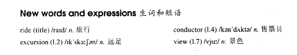

# Lesson 50

## Words

- ride excursion conductor view

- 

## Taken for a ride

```
I love traveling in the country, but I don't like losing my way. I went on an excursion recently, but my trip took me longer than I expected.

'I'm going to Woodford Green,' I said to the conductor as I got on the bus, 'but I don't know where it is.' 'I'll tell you where to get off,' answered the conductor.

I sat in the front of the bus to get a good view of the countryside. After some time, the bus stopped.

Looking round, I realized with a shock that I was the only passenger left on the bus.

'You'll have to get off here,' the conductor said. 'This is as far as we go.'

'Is this Woodford Green?' I asked. 'Oh dear,' said the conductor suddenly. 'I forgot to put you off.' 'It doesn't matter,' I said. 'I'll get off here.'

'We're going back now,' said the conductor.

'Well, in that case, I prefer to stay on the bus,' I answered.
```

## Whole

1. 标题 `taken for a ride` 有双关的意思

   - 出去旅游了一圈

   - 被骗了

2. `go on an excursion` 去郊游（近距离）

   ```
   Both my father and my mother went on an excursion the day before last.

   Next week either Jack or Tom is going on an excursion.
   ```

3. `conductor` 更多地表示 `乐队的指挥` 这个角色

4. `get a good view of sth.` 看到了某个美景

   ```
   I got a good view of the mountain I'm standing in front of.

   From here, I'm getting a good view of the city that I've never seen before.
   ```

5. `take it for granted` 把它视作理所当然

   ```
   Don't take it for granted.
   ```

6. `in the front of the bus` & `in front of the bus`

   - `in the front of the bus` (inside) 汽车内部的前面。如坐在前排座位

   - `in front of the bus` (outside) 汽车外部的前面。汽车可以撞过去

7. `love/like doing sth.` 喜欢做某事

   ```
   I love fishing in the river.

   I like going to sleep early every night.
   ```

8. `it takes sb. st. to do sth.` 做某事花了某人多长时间

   ```
   This trip took me three hours.

   It took him an hour to cook rice.
   ```

9. M: `where to get off` 是比较口语化的，相当于一个省略句，完整的句子是 `where I should get off`

   - `where to get off` = `where I should get off`

   - `I wonder who to invite` = `I wonder who I should invite`

   - `tell us what to do` = `tell us what we should do`

   ```
   I don't know where to park the car.

   I don't know where I should park the car.


   Tell me when to pay.

   Tell me when I should pay.
   ```

10. `I realized with a shock that ...` 我震惊地意识到...

    ```
    I realized with a shock that he smashed everything in the kitchen to pieces.

    I realized with a shock that a gust of wind swept his bed off the roof.
    ```

11. `on earth` & `on the earth`

    - `on earth` 实际上是语气词，只是为了加强疑问的语气。表示 `究竟，到底`

      ```
      What on earth is he doing?
      他究竟在干什么？

      Why on earth does he do this?
      他究竟为什么要这么做？

      When on earth will you arrive here?
      你究竟什么时候到这里？
      ```

    - `on the earth` 在地球上

      ```
      All people were confined on the earth.
      ```

12. M: `prefer`

    - `prefer to do sth.` = `prefer doing sth.` 更愿意/更想要做某事

      ```
      I don't like cities. I prefer to live in the country.

      I don't like cities. I prefer living in the country.


      I don't get up on Sundays. I prefer staying in bed.

      I don't get up on Sundays. I prefer to stay in bed.
      ```

    - `I prefer A to B` 和 B 相比起来我更喜欢 A

      ```
      I prefer the red apple to the green apple.
      和绿色的苹果比起来，我更喜欢红色的苹果

      I prefer basketball to football.
      ```

    - `I prefer doing A to doing B` 和做 A 这件事相比起来我更喜欢做 B 这件事

      ```
      I prefer riding to walking.
      和走路比起来，我更喜欢骑车

      I prefer going to the cinema to watching DVDs at home.
      ```

    - `I prefer to do A rather than (do) B` 和做 A 这件事相比起来我更喜欢做 B 这件事

      ```
      Jack prefers to live in the country rather than (live) in the city.
      和住在城市比起来，杰克更喜欢住在乡下

      I prefer to drive rather than travel by train.
      ```

    - `would prefer`

      - `I would prefer to do sth.` = `I'd prefer to do sth.` 更愿意/更想要做某事

        ```
        I'd prefer to drive.

        I'd prefer to have dinner now.

        Would you prefer to have dinner now?
        ```

      - `I'd prefer to do A rather than (do) B` 和做 A 这件事相比起来我更喜欢做 B 这件事

        ```
        I'd prefer to stay at home tonight rather than go to the cinema.
        和去电影院相比，今晚我更想在家待着
        ```

## Exercises

```
Look at him! He's kicking the dog.

I refuse to look at anyone who kicks dogs.
```

```
Listen to him! He's shouting at the speaker.

I refuse to listen to anyone who interrupts speakers.
```

```
Look at him! He's stealing the bird's egg.

I refuse to look at anyone who steals bird's egg.
```

```
Look at him! He's hitting a little boy.

I refuse to look at anyone who hits boys.
```

```
Listen to him! He's playing a pop song.

I refuse to listen to anyone who plays pop songs.
```

```
Why are you buying the Ford? Why don't you buy a Fiat?

I prefer Fords.
```

```
Why are you making tea? Why don't you make coffee?

I prefer tea.
```

```
Why are you going out with Jack? Why don't you go out with Mary?

I prefer to go out with Jack.
```

```
Why is he studying Chinese? Why doesn't he study English?

He prefers to study Chinese.
```

```
Why is she writing a novel? Why doesn't she write play?

She prefers writing novels.
```

```
Why on earth is she buying that hat?

I expect she likes it.
```

```
Why on earth is she wearing that dress?

I expect she likes it.
```

```
Why on earth is he exercising his dogs?

I expect he likes them.
```

```
Why on earth is he feeding the lions?

I expect he likes them.
```

```
Why on earth is he teaching May?

I expect he likes her.
```

```
Why on earth is she helping that man?

I expect she likes him.
```

```
Hasn't she arrived yet?

No, but I'm expecting her to arrive any minutes now.
```

```
Hasn't he gotten back yet?

No, but I'm expecting him to get back any minutes now.
```

```
Hasn't he come to see you yet?

No, but I'm expecting him to come to see me any minutes now.
```

```
Hasn't she booked the seats yet?

No, but I'm expecting her to book them any minutes now.
```

```
Hasn't Jack cooked the lunch yet?

No, but I'm expecting him to cook it any minutes now.
```
