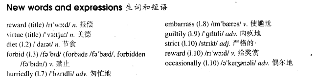

# Lesson 51

## Words

- reward virtue diet forbid hurriedly embarrass guiltily strict occasionally

- 

## Reward for virtue

```
My friend, Hugh, has always been fat, but things got so bad recently that he decided to go on a diet.

He began his diet a week ago. First of all, he wrote out a long list of all the foods which were forbidden.

The list included most of the things Hugh loves: butter, potatoes, rice, beer, milk, chocolate, and sweets.

Yesterday I paid him a visit. I rang the bell and was not surprised to see that Hugh was still as fat as ever.

He led me into his room and hurriedly hid a large parcel under his desk. It was obvious that he was very embarrassed.

When I asked him what he was doing, he smiled guiltily and then put the parcel on the desk.

He explained that his diet was so strict that he had to reward himself occasionally.

Then he showed me the contents of the parcel. It contained five large bars of chocolate and three bags of sweets!
```

## Whole

1. `go on a diet` = `be on a diet` 节食

   ```
   He goes on a diet.

   He is on a diet.

   Most people prefer to go on a diet rather than go to a gym.

   Being so fat at that time, he was on a diet.
   ```

2. `forbid sb. to do sth.` 禁止某人做某事

   ```
   They forbade us to talk about it.
   ```

3. `A be strict with B` A 对 B 很严厉

   ```
   She is very strict with her students.

   Why are you always strict with me?
   ```

4. `give sb. a reward` 给某人一个奖励

   ```
   You should give him a reward he wanted.
   ```

5. `first of all` 首先

   ```
   First of all, I want you to know that I prefer swimming to running.

   First of all, the bell will ring and then you must go out as fast as you can.
   ```

6. `write out a long list of sth.` 写出一张某物的长长的单子

   ```
   He wrote out a long list of all the cars he owns.
   ```

7. `pay sb. a visit`，`pay a visit` 拜访某人

   ```
   I paid him a visit last night.

   Although she didn't like his house, she paid him a visit yesterday evening.

   Not liking his house, she paid him a visit yesterday evening.
   ```

8. `was not surprised to see that...` 看到某事并不感到惊讶

   ```
   They were not surprised to see that the gust of wind blew the bed off the courtyard below.

   I wasn't surprised to see that my dog smashed the sofa to pieces.
   ```

9. `it was obvious that...` 某事是显而易见的

   ```
   It was obvious that she prefers running to fishing.
   比起钓鱼，她明显更喜欢跑步

   It was obvious that they were tired of fishing.
   ```

10. `have a day off work` 请一天假

    ```
    Had he had a day off work last month?
    ```

## Exercises

```
Did you paint the gate last week?

Yes, I mended it first and then I painted it.
```

```
Did you give a lecture last week?

Yes, I prepared it first and then I gave it.
```

```
Did you eat those vegetables last week?

Yes, I washed it first and then I ate it.
```

```
Did you sell the machine last week?

Yes, I repaired it first and then I sold it.
```

```
Did you use your bicycle last week?

Yes, I oiled it first and then I used it.
```

```
He went on a diet once, didn't he?

Yes, he did. His wife begged him to.
```

```
He cleaned the car once, didn't he?

Yes, he did. His wife asked him to.
```

```
She borrowed some money once, didn't she?

Yes, she did. Her husband wanted her to.
```

```
He washed his socks once, didn't he?

Yes, he did. His wife told him to.
```

```
She changed her job once, didn't she?

Yes, she did. Her husband advised her to.
```

```
When did she find the body?

She found it when she returned home.
```

```
When did he discover the gun?

He discovered it when he entered the room.
```

```
When did he run to the phone?

He ran to it when he saw the man.
```

```
When did she hear a movement?

She heard it when she walked forward.
```

```
When did he drop the gun?

He dropped it when he fell to the floor.
```

```
Are they going to give a party this month?

I don't expect so. They gave one last month.
```

```
Is he going to buy a new flat this year?

I don't expect so. He bought one last year.
```

```
Is she going to have a day off work this week?

I don't expect so. She had one last week.
```

```
Are they going to enter for a competition this month?

I don't expect so. They entered one last month.
```

```
Are they going to see a football match this month?

I don't expect so. They saw one last month.
```
