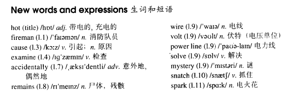

# Lesson 53

## Words

- hot fireman cause examine accidentally remains wire volt solve mystery snatch spark power carelessly explanation

- 

## Hot snake

```
At last firemen have put out a big forest fire in California. Since then, they have been trying to find out how the fire began.

Forest fires are often caused by broken glass or by cigarette ends which people carelessly throw away.

Yesterday the fireman examined the ground carefully, but were not able to find any broken glass. They were also quite sure that a cigarette end did not start the fire.

This morning, however, a fireman accidentally discovered the cause.

He noticed the remains of a snake which was wound round the electric wires of a 16000 - volt power line. In this way, he was able to solve the mystery.

The explanation was simple but very unusual. A bird had snatched up the snake from the ground and then dropped it on to the wires.

The snake then wound itself round the wires. When it did so, it sent sparks down to the ground and these immediately started a fire.
```

## Whole

1. `power line` 电线

   ```
   Don't touch the power line.

   Stay away from the power line.
   ```

2. `remain a mystery` 一直是一个谜

   ```
   It remains a mystery that how he got in the room.
   ```

3. `solve problem` 解决问题

   ```
   I wasn't surprised to see that he was able to solve the problem.
   ```

4. `solve mystery` 揭开谜底

   ```
   I've been trying to solve the mystery.
   ```

5. `since then` 从那时开始。这个短语常常和 `现在完成进行时` 一起出现

   ```
   Since then, she's been practicing tennis very hard for the championship.
   ```

6. `find out` 发现；弄明白

   ```
   I need to find out who did that.
   ```

7. `throw away` 扔掉

   ```
   We needn't have thrown it away.
   ```

8. `ring sb. up` 打电话给某人

   ```
   He'll ring you up immediately.
   ```

## Exercises

```
You look upset. What've you been doing?

I've been saying goodbye to a friend.
```

```
You look dirty. What've you been doing?

I've been cleaning the garage.
```

```
He looks wet. What has he been doing?

He's been walking in the rain.
```

```
They look tired. What've they been doing?

They've been driving all night.
```

```
You look angry. What've you been doing?

I've been fighting with John.
```

```
Have you finished that book already?

Well, I've been reading it all day.
```

```
Have you finished the speech already?

Well, I've been preparing it for hours.
```

```
Have you finished the book already?

Well, I've been studying it all term.
```

```
Have you finished the work already?

Well, I've been doing it since 9 o'clock.
```

```
Have you finished the fruit already?

Well, I've been eating it since tea time.
```

```
Have they been taking their exams?

Yes, they have. They've taken five of them so far.
```

```
Have they been correcting their essays?

Yes, they have. They've corrected three of them so far.
```

```
Have they been opening their presents?

Yes, they have. They've opened four of them so far.
```

```
Have they been visiting the museums?

Yes, they have. They've visited two of them so far.
```

```
Have they been making the beds?

Yes, they have. They've made eight of them so far.
```

```
Why hasn't she rung John up yet?

What do you mean? She's been ringing him up all morning.
```

```
Why hasn't he packed the clothes yet?

What do you mean? He's been packing them all morning.
```

```
Why haven't you practiced the piano yet?

What do you mean? I've been practicing the piano all morning.
```

```
Why hasn't she done the washing yet?

What do you mean? She's been doing the washing all morning.
```

```
Why hasn't he spoken to Jack yet?

What do you mean? He's been speaking to Jack all morning.
```
