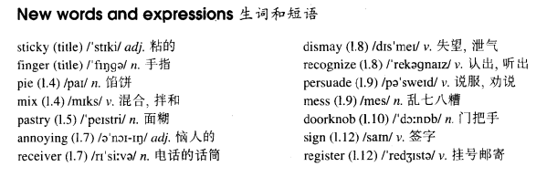

# Lesson 54

## Words

- sticky finger pie mix pastry annoying receiver dismay recognize persuade mess doorknob sign register flour

- 

## Sticky finger

```
After breakfast, I sent the children to school and then I went to the shops.

It was still early when I returned home. The children were at school, my husband was at work and the house was quiet. So I decided to make some meat pies.

In a short time I was busy mixing butter and flour and my hands were soon covered with sticky pastry.

At exactly that moment, the telephone rang. Nothing could have been more annoying.

I picked up the receiver between two sticky fingers and was dismayed when I recognized the voice of Helen Bates.

It took me ten minutes to persuade her to ring back later. At last I hung up the receiver.

What a mess! There was pastry on my fingers, on the telephone, and on the doorknobs.

I had no sooner got back to the kitchen than the doorbell rang loud enough to wake the dead.

This time it was the postman and he wanted me to sign for a registered letter!
```

## Questions

1. Q: `Nothing could have been more annoying` 是什么语法？ `can have been`?

## Whole

1. `stick to the plan` 坚持这个计划

   ```
   Absolutely not, we have to stick the plan.
   ```

2. `put my finger on it`

   ```
   I could never put my finger on it, but something just wasn't right.
   // Q: 翻译这句话
   ```

3. `point the finger at...`

   ```
   I guess we'll know who to point the finger at on that one, won't we?
   // Q: 翻译这句话
   ```

4. `pick up receiver` 拿起电话，接电话

   ```
   I had no sooner got into the room than picked up the receiver.
   ```

5. `hang up receiver` 挂起电话，挂电话

   ```
   I had hardly heard the doorbell rang when hung up the receiver.
   ```

6. `be dismay to do sth.` 对做某事感到失望

   ```
   I was dismay to learn that she had failed again.
   ```

7. `persuade sb. to do sth.` 劝某人去做某事

   ```
   I don't think I'll persuade you at all.
   ```

8. `sign for sth.` 签收某物

   ```
   The postman asked me to sign for the parcel.
   ```

9. `a registered letter` 挂号信

   ```
   Can you tell me the difference between the registered letter and that one on the desk.
   ```

## Exercises

```
How long have you been a shoemaker?

I've been making shoes for a long time.
```

```
How long have you been a stamp collector?

I've been collecting stamps for a long time.
```

```
How long have you been a horse trainer?

I've been training horses for a long time.
```

```
How long have you been a tax collector?

I've been collecting tax for a long time.
```

```
How long have you been an act teacher?

I've been teaching act for a long time.
```

```
He didn't teach here for long, didn't he?

No, he taught there for a year and then he left.
```

```
He didn't park here for long, didn't he?

No, he parked there for ten minutes and then he left.
```

```
She didn't live here for long, didn't she?

No, she lived there for three months and then she left.
```

```
You didn't lecture here for long, didn't you?

No, I lectured there for a month and then I left.
```

```
They didn't work here for long, didn't they?

No, they worked there for a few month and then they left.
```

```
Could you lend me your dictionary?

I'm sorry. I lent it to Tom last week and he hasn't returned it yet.
```

```
Could you lend me your ladder?

I'm sorry. I lent it to Jack last week and he hasn't returned it yet.
```

```
Could you lend me your hammer?

I'm sorry. I lent it to Jack last month and he hasn't returned it yet.
```

```
Could you lend me your black boots?

I'm sorry. I lent them to Jack last week and he hasn't returned it yet.
```

```
Could you lend me your garden tools?

I'm sorry. I lent them to Jack last week and he hasn't returned it yet.
```
