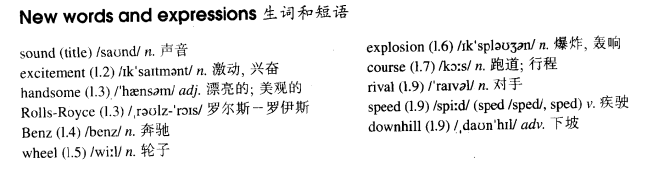

# Lesson 56

## Words

- sound excitement handsome Benz wheel explosion course rival speed sped downhill pleasure deal

- 

## Faster than sound

```
Once a year, a race is held for old cars. A lot of cars entered for this race last year and there was a great deal of excitement just before it began.

One of the most handsome cars was a Rolls-Royce Silver Ghost.

The most unusual car was a Benz which had only three wheels. Built in 1885, it was the oldest car taking part.

After a great many loud explosions, the race began. Many of the cars broke down on the course and some drivers spent more time under their cars than in them!

A few cars, however, completed the race. The winning car reached a speed of forty miles an hour - much faster than any of its rivals.

It sped downhill at the end of the race and its driver had a lot of trouble trying to stop it.

The race gave everyone a great deal of pleasure. It was very different from modern car races but no less exciting.
```

## Whole

1. `Rolls Royce` 劳斯莱斯汽车

2. `hear/make sound` 听到/发出声响

   ```
   I've been hearing a sound that's so loud.
   ```

3. `speed this thing up` 加快这件事的速度；加快速度去做某事

   ```
   The water is still too cold, it must be warmed at once, I need you to speed things up.
   // 加快`让水变热`这件事的速度

   I think I can speed it up.

   There may be a way to speed this up.
   ```

4. `go downhill` 走下坡路。形容某事开始每况愈下，渐渐变坏

   ```
   After his wife had died, his health started to go downhill.
   ```

5. `a great deal of sth.(un.)` 大量的某物(不可数名词)。和 `a great number of sth.` 类似

   ```
   He realized that he had lost a great deal of money.

   I don't have a great deal of time here.

   He has made a great deal of progress.
   ```

6. `break down` 汽车故障

   ```
   My car has just broken down.
   ```

7. `A be different from B` A 和 B 不一样

   ```
   No one could account for the fact that he is so different from his twin brother.

   Why are you so different from them?
   ```

## Exercises

```
Are you as tall as Jack?

I don't think so. I think Jack's a little taller than me.
```

```
Is he as intelligent as Jack?

I don't think so. I think Jack's a little more intelligent than him.
```

```
Are they as capable as Jack?

I don't think so. I think Jack's a little more capable than them.
```

```
Are you as active as Jack?

I don't think so. I think Jack's a little more active than me.
```

```
Are you as unlucky as Jack?

I don't think so. I think Jack's a little unluckier than me.
```

```
My brother is much taller than yours.

He isn't. They're about the same height.
```

```
My house is much older than yours.

It isn't. They're about the same age.
```

```
My case is much heavier than yours.

It isn't. They're about the same weight.
```

```
My shoes are much larger than yours.

They aren't. They're about the same size.
```

```
My ruler is much longer than yours.

It isn't. They're about the same length.
```

```
Is Scotch whisky very different from Irish whisky?

A Scot could tell you better than I can!
```

```
Is China wine very different from Japan wine?

A Chinese could tell you better than I can!
```

```
Is Russia customs very different from French customs?

A Russian could tell you better than I can!
```

```
Is Italy stereos very different from Korea stereos?

An Italian could tell you better than I can!
```

```
Is American art very different from Chinese art?

An American could tell you better than I can!
```

```
What a lot of eggs Jack's taken!

Yes, he's taken many more than he did yesterday.
```

```
What a lot of pictures Jack's painted!

Yes, he's painted many more than he did yesterday.
```

```
What a lot of beer you have drunk!

Yes, I've drunk much more than I did yesterday.
```

```
What a lot of sweets Jack's bought!

Yes, he's bought much more than he did yesterday.
```

```
What a lot of flowers he's picked!

Yes, he's picked many more than he did yesterday.
```
