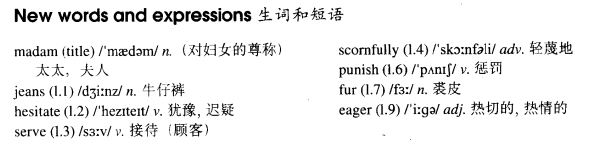

# Lesson 57

## Words

- madam jeans hesitate serve scornfully punish fur eager seek

- 

## Can I help you, madam?

```
A woman in jeans stood at the window of an expensive shop. Though she hesitated for a moment, she finally went in and asked to see a dress that was in the window.

The assistant who served her did not like the way she was dressed. Glancing at her scornfully, he told her that the dress was sold.

The woman walked out of the shop angrily and decided to punish the assistant next day.

She returned to the shop the following morning dressed in a fur coat, with a handbag in one hand and a long umbrella in the other.

After seeking out the rude assistant, she asked for the same dress. Not realizing who she was, the assistant was eager to serve her this time.

With great difficulty, he climbed into the shop window to get the dress. As soon as she saw it, the woman said she did not like it.

She enjoyed herself making the assistant bring almost everything in the window before finally buying the dress she had first asked for.
```

## Whole

1. 文中 `she enjoyed herself making the assistant bring almost everything in the window` 的 `making` 可以理解为 `分词作状语`，同时 `while` 被省略掉了。完整的可以句子可以是以下

   ```
   She enjoyed herself while making the assistant bring almost everything in the window.
   ```

2. `hesitate for a moment/second` 犹豫一会

   ```
   He hesitated for a second before opening the door.
   // 并不是具体的 `一秒钟`，只是用来指代时间很短
   ```

3. `hesitate to do sth.` 犹豫要不要去做某事

   ```
   If there's anything we can do, please don't hesitate to tell us.
   ```

4. `we don't serve steak` 我们不提供牛排。如果是在餐厅，这家餐厅可能没有牛排这个菜，那么就可以使用这句

   ```
   Do you serve beer or any drink?
   你们这儿有啤酒或其它什么喝的吗？
   ```

5. `look down on sb.` 有 `狗眼看人低` 的意思，对某人这样。和 `scornfully` 类似

   ```
   You are so perfect you can look down on me?
   就算你这么完美，但你就能这么轻蔑地看着我了？
   ```

6. `be eager to do sth.` 渴望做某事，对做某事很热情

   ```
   He was eager to help me to move into my new house.
   ```

7. `ask to do sth.` 要求去做某事

   ```
   I asked to see my records.
   ```

8. `be dressed in...` 穿着...。这里是被动，但是翻译为中文时按照中文的习惯说法不会说 `被穿在...里`，直接说 `穿着` 什么什么东西。因为早期的英国女人特别是贵族，会穿着非常紧身的衣服，这些衣服通过需要仆人来帮忙才能穿上去，比如帮忙在拉上衣服后面的拉链，所以是 `被穿在...里`

   ```
   The guys we're killing are dressed in expensive suits.

   We are dressed in our best.
   我们穿着我们最好的衣服
   ```

9. `seek out` 寻找

   ```
   She sought out the rude assistant.
   ```

10. `make sb. do sth.` 让某人做某事

    ```
    Don't make me do this.

    My mom made me get my bedroom in order last night.
    ```

11. M: `the way` 引导的定语从句。这种情况下 `the way` 表示 `以这样的方式`

    ```
    I don't like the way (that) you talk to me.
    我不喜欢你跟我聊天的这个方式
    // `that` 可加可不加。不过通常是不会加上的
    // `that` 后面的 `you talk to me` 就是修饰 `the way` 的定语

    We want to know the way you learn new words.
    我想知道你学习新单词的方式

    I like the way you look at the world.

    I see the way you look at me.
    ```

12. `in` & `with`

    - `in` 可以表示 `穿着`，身体被某物包裹着。和 `wear` 类似

      ```
      I saw a man who was wearing a black suit.

      I saw a man in a black suit.
      // 和上一句等价


      I saw a man who was wearing a red tie.

      I saw a man in a red tie.
      ```

    - `with` 可以表示 `伴随；和`。某人的所拥有或带着的东西

      ```
      I saw a man who was carrying a brown handbag.

      I saw a man with a brown handbag.
      // 和上一句等价


      I saw a man who had a scar on his face.

      I saw a man with a scar on his face.


      I saw a man who had blue eyes.

      I saw a man with blue eyes.
      ```

## Exercises

```
Shall we meet at the station?

Yes, I'll wait for you under the clock.
```

```
Shall we meet at the cinema?

Yes, I'll wait for you near the ticket office.
```

```
Shall we meet at the school?

Yes, I'll wait for you in the hall.
```

```
Shall we meet at the hotel?

Yes, I'll wait for you in the lounge.
```

```
Shall we meet at the car park?

Yes, I'll wait for you by the ticket machine.
```

```
Lucy looks very young in that bikini, doesn't she?

She looks young in anything!
```

```
Lucy looks very smart in that coat, doesn't she?

She looks smart in anything!
```

```
Lucy looks very pretty in that long dress, doesn't she?

She looks pretty in anything!
```

```
Jack looks very handsome in that uniform, doesn't he?

He looks handsome in anything!
```

```
Tom looks very silly in that little hat, doesn't he?

He looks silly in anything!
```

```
The police say the man they're looking for has a beard.

There's a man with a beard over there!
```

```
The police say the man they're looking for has a bald head.

There's a man with a bald head over there!
```

```
The police say the woman they're looking for has a broken leg.

There's a woman with a broken leg over there!
```

```
The police say the child they're looking for has a brown dog.

There's a child with a brown dog over there!
```

```
The police say the dog they're looking for has two black spots on it.

There's a dog with two black spots on it over there!
```

```
It's hot. Why doesn't he take off his coat?

He says he wants to keep it on.
```

```
It's hot. Why doesn't he take off his boots?

He says he wants to keep them on.
```

```
It's hot. Why doesn't she take off her pullover?

She says she wants to keep it on.
```

```
It's hot. Why doesn't she take off her uniform?

She says she wants to keep it on.
```

```
It's hot. Why doesn't he take off his sweater?

He says he wants to keep it on.
```
