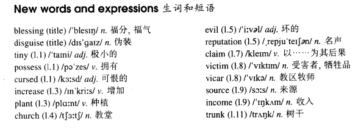

# Lesson 58

## Words

- blessing disguise tiny possess cursed increase plant church evil reputation claim victim vicar source income trunk

- 

## A blessing in disguise?

```
The tiny village of Frinley is said to possess a 'cursed tree'. Because the tree was mentioned in a newspaper, the number of visitors to Frinley has now increased.

The tree was planted near the church fifty years ago, but it is only in recent years that it has gained an evil reputation.

It is said that if anyone touches the tree, he will have bad luck; if he picks a leaf, he will die. Many villagers believe that the tree has already claimed a number of victims.

The vicar has been asked to have the tree cut down, but so far he has refused.

He has pointed out that the tree is a useful source of income, as tourists have been coming from all parts of the country to see it.

In spite of all that has been said, the tourists have been picking leaves and cutting their names on the tree - trunk. So far, not one of them has been struck down by sudden death!
```

## Questions

1. `is said` 听说？

2. `In spite of all that has been said` 就算有这些传言

3. `their names on the tree` 什么名词

4. `not one of them has been struck down by sudden death` 中的 `not` 在开头什么作用

5. Q: `But now standing over me she looked like a huge tree trunk` 翻译这句话

6. Q: `have the tree cut down` 语法

## Whole

1. `God bless you` 愿上帝保佑你。西方国家的人很常用的口语

2. `a blessing in disguise` 因祸得福。有 `塞翁失马，焉知非福` 的意思

   ```
   You know, changing jobs can be a blessing in disguise.
   你知道吗，换一个工作可能会更好
   // 可能是被公司辞退了
   ```

3. `baggage claim` 行李提取处，下飞机后取行李的地方。飞机场通常都会有这个地方

   ```
   Is it possible you left it in baggage claim?
   ```

4. `claim one's life` 夺走某人的生命

   ```
   The thing you're doing might claim your life and you must stop it!
   ```

5. `have a reputation for...` 因...的名声而为人称道

   ```
   He has got a reputation for honesty.
   ```

6. `a number of sth.` 一些...。和 `several` 类似

   ```
   Finally the two detectives found out a number of postcards with four words on it.
   ```

7. `sb. point out that...` 某人指出...

   ```
   The leader of the pirates suddenly pointed out that a treasure was just at the entrance near that seashore.
   ```

8. `vacant post` 空缺的职位

9. M: `be said to do sth.` = `it is said that...` 都表示 `据说...`

   ```
   He is the richest man in the world.

   He is said to be the richest man in the world.

   It is said that he is the richest man in the world.


   She works 16 hours a day.

   She is said to work 16 hours a day.

   It's said that she works 16 hours a day.


   The tiny village possesses a 'cursed tree'.

   The tiny village is said to possess a `cursed tree`.

   It's said that the tiny village possesses a 'cursed tree'.
   ```

10. M: `强调句`

    - 着重强调某个人/东西，加强语气

      ```
      那个新手机是我在她生日的时候送给她的。
      // 中文的强调句要靠说话的语气来表达。不是别的日子，就是在她生日的日子里送给她的
      ```

    - 强调人/东西。句型: `it is/was + 强调部分 + that/who + 剩余部分`

      ```
      My secretary sent the bill to Jack yesterday.
      // 没有强调什么，只是平铺直叙地表达

      It was the bill that my secretary sent to Jack yesterday.
      昨天我的秘书把这张账单发给了Jack
      // 强调 `这张账单`，而不是别的什么东西
      // `the bill` 就是强调部分，剩余的句子照抄就好了

      It was my secretary that sent the bill to Jack yesterday.
      // 强调的 `是我的秘书` 而不是别人，把这张账单发给Jack

      It was Jack who my secretary sent the bill to yesterday.
      // 强调 `发给了Jack`，而不是把账单发给别的什么人
      // 如果强调的是人，那么也可以使用 `who`，但 `that` 是万能的，所以还是推荐用 `that`

      It was yesterday that my secretary sent the bill to Jack.
      // 强调的是 `昨天发的账单`，而不是前天，明天

      My secretary did send the bill to Jack yesterday.
      我的秘书真的把这张账单发给Jack了
      // 如果是强调


      It has gained an evil reputation only in recent years.

      It is it that has gained an evil reputation only in recent years.
      // 错误。不能用 `it is it`，这个 `it` 必须变成具体的东西

      It is the tree that has gained an evil reputation only in recent years.
      // 正确。`it` 指代 `the tree`
      ```

    - 强调动作。在动词前面根据时态加上 `do`,`does`,`did`

      ```
      My secretary sent the bill to Jack yesterday.
      // 没有强调什么，只是平铺直叙地表达

      My secretary did sent the bill to Jack yesterday.
      我的秘书真的把这张账单发给Jack了
      // 强调 `发送`，真的发送了，这个动作真的已经做了
      // 一句话中只能有一个时态。因为有 `did`，所以 `sent` 需要换回原形


      I like tea.

      I do like tea.
      我很喜欢茶/我真的非常喜欢茶/我太喜欢茶了


      He wants some water.

      He does want some water.
      他真的想要一些水
      // 太渴了
      ```
