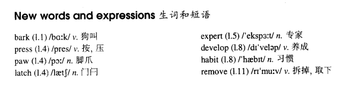

# Lesson 59

## Words

- bark press paw latch expert develop habit remove

- 

## In or out?

```
Our dog, Rex, used to sit outside our front gate and bark. Every time he wanted to come into the garden he would bark until someone opened the gate.

As the neighbours complained of the noise, my husband spent weeks training him to press his paw on the latch to let himself in. Rex soon became an expert at opening the gate.

However, when I was going out shopping last week, I noticed him in the garden near the gate. This time he was barking so that someone would let him out!

Since then, he has developed another bad habit. As soon as he opens the gate from the outside, he comes into the garden and waits until the gate shuts.

Then he sits and barks until someone lets him out. After this he immediately lets himself in and begins barking again.

Yesterday my husband removed the gate and Rex got so annoyed we have not seen him since.
```

## Whole

1. `become/be an expert at doing sth.` 成为做某事的专家

   ```
   I have become an expert at feeding pandas.

   I'm an expert at the game.
   ```

2. `have a habit of doing sth.` 习惯于做某事

   ```
   She has a habit of going to school on foot.
   ```

3. `sb. develop habit of doing sth.` 某人养成了做某事的习惯

   ```
   He developed the habit of going to gym after work.
   ```

4. `remove sth. from...` 从...中移除某物

   ```
   We will soon remove the sentence from the website.
   ```

5. `take a piss` 小便；撒尿

   ```
   Every time you need to go to take a piss, just go, needn't tell me.
   ```

6. `complain of...` 抱怨...

   ```
   He is said to complain of his boss all the time.
   ```

7. `spend st. doing sth.` 花费多长时间去做某事

   ```
   Because he didn't have no legs, he spent most of time exercising his arms.

   They spent three years looking for the treasure map.
   ```

8. `train sb. to do sth.` 训练某人去做某事

   ```
   He trains the dog to do this.

   They have been training Jack to swimming better since last year.
   ```

9. 文中 `Rex got so annoyed we have not seen him since` 这句话应该是 `so...that...` 句型，但是 `that` 被省略掉了。`so...that...` 句型中 `that` 是可以被省略的。因此完整的句子如下

   ```
   Rex got so annoyed that we have not seen him since.
   ```

10. M: `get done` 也可以表示被动，和 `be done` 一致。但 `get done` 更偏向于口语表达

    ```
    Carrots were eaten by the rabbit.

    Carrots got eaten by the rabbit.
    // 和上一句等价
    ```

    - [get 的被动用法](https://www.ruanyifeng.com/blog/2006/06/get-passive.html)

11. M: `so that` 引导的 `目的状语从句`

    - 通常可以理解为 `以便，为了`

      ```
      我每天都写日记，这样我就不用去记住每一件事
      // `写日记` 的目的就是为了 `不用去记住每一件事`

      警察每天都在维护秩序，以便城市能够正常运转
      // `维护秩序` 的目的就是为了 `城市正常运转`
      ```

    - 和 `so that` 类似的还有: `to`, `in order to`, `so as to`, `in order that`

    ```
    I wrote them down in my diary so that I wouldn't have to remember.
    我把它们写在我的日记里，以便我不用去记住它们
    // `so that` 连接两个句子

    So that I wouldn't have to remember, I wrote them down in my diary.
    // 两个句子的顺序可以互换

    Put your name on the top of the paper so that I know who did such good work.

    My sister saved up so that I could go to school and be a teacher.
    ```

## Exercises

```
He's reading the paper, isn't he?

Yes, he always reads the paper at this time of the day.
```

```
They are attending a meeting, aren't they?

Yes, they always attend a meeting at the time of the day.
```

```
He's speaking to his secretary, isn't he?

Yes, he always speaks to his secretary at the time of the day.
```

```
You're reading your email, aren't you?

Yes, I always read my email at the time of the day.
```

```
You're going to the bank, aren't you?

Yes, I always go to the bank at the time of the day.
```

```
She's playing the piano, isn't she?

Yes, she's been playing the piano all morning.
```

```
You're reading your library book, aren't you?

Yes, I've been reading my library book all morning.
```

```
She's writing her invitations, isn't she?

Yes, she's been writing her invitations all morning.
```

```
He's working on her new book, isn't he?

Yes, he's been working on his new book all morning.
```

```
He's doing an experiment, isn't he?

Yes, he's been doing an experiment all morning
```

```
I was told that films were made here.

They used to be made here, but they aren't any more.
```

```
He was told that tomatoes were grown here.

They used to be grown here, but they aren't any more.
```

```
We were told that horses were trained here.

They used to be trained here, but they aren't any more.
```

```
He was told that meals were served here.

They used to be served here, but they aren't any more.
```

```
We were told that radios were repaired here.

They used to be repaired here, but they aren't any more.
```

```
You've taken your time! What on earth have you been doing?

I'm sorry. We got stopped by the police.
```

```
You've taken your time! What on earth have you been doing?

I'm sorry. We got delayed by fog.
```

```
You've taken your time! What on earth have you been doing?

I'm sorry. We got involved in an argument.
```

```
You've taken your time! What on earth have you been doing?

I'm sorry. We got caught in a traffic jam.
```

```
You've taken your time! What on earth have you been doing?

I'm sorry. We got lost in a town.
```
