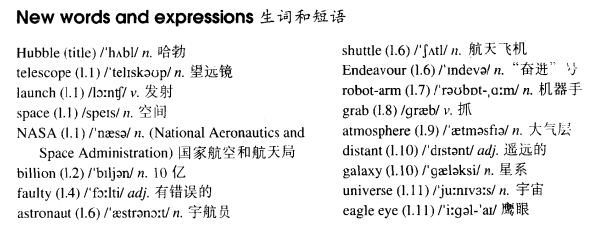

# Lesson 61

## Words

- Hubble telescope launch space NASA national aeronautics billion faulty astronaut shuttle Endeavour grab atmosphere distant galaxy universe eagle

- 

## Trouble with the Hubble

```
The Hubble telescope was launched into space by NASA on April 20, 1990 at a cost of over a billion dollars.

Right from the start there was trouble with the Hubble. The pictures it sent us were very disappointing because its main mirror was faulty!

NASA is now going to put the telescope right, so it will soon be sending up four astronauts to repair it. The shuttle Endeavour will be taking the astronauts to the Hubble.

A robot-arm from the Endeavour will grab the telescope and hold it while the astronauts make the necessary repairs.

Of course, the Hubble is above the earth's atmosphere, so it will soon be sending us the clearest pictures of the stars and distant galaxies that we have ever seen. The Hubble will tell us a great deal about the age and size of the universe.

By the time you read this, the Hubble's eagle eye will have sent us thousands and thousands of wonderful pictures.
```

## Questions

1. `at a cost of over a billion dollars` 花费超过十亿美元

2. `Right from the start`

3. `NASA is now going to put the telescope right` 中的 `right`，`纠正`？

4. `thousands and thousands of wonderful pictures` 很多很多令人惊奇的图片

## Whole

1. `robot arm` 机械臂

2. `eagle eye` 鹰眼
