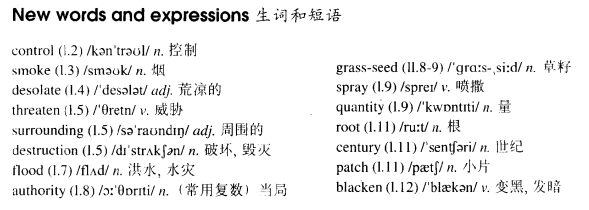

# Lesson 62

## Words

- control smoke desolate threaten surrounding destruction flood authority grass seed spray quantity root century patch blacken serous

- 

## After the fire

```
Fireman had been fighting the forest fire for nearly three weeks before they could get it under control.

A short time before, great trees had covered the countryside for miles around. Now, smoke still rose up from the warm ground over the desolate hills.

Winter was coming on and the hills threatened the surrounding villages with destruction, for heavy rain would not only wash away the soil but would cause serous floods as well.

When the fire had at last been put out, the forest authorities ordered several tons of a special type of grass-seed which would grow quickly.

The seed was sprayed over the ground in huge quantities by aeroplanes. The planes had been planting seed for nearly a month when it began to rain. By then, however, in many places the grass had already taken root.

In place of the great trees which had been growing there for centuries, patches of green had begun to appear in the blacken soil.
```

## Whole

1. `grass seed` 草籽

   ```
   There is not only some grass seed but also a bar of cheese in this bag.
   ```

2. `get sth. under control` 使某物得到控制

   ```
   If you can get the crazy dog under control, we'll talk.

   It's said that she can always get everything under control.
   ```

3. `threaten sb. with sth.` 用某物威胁某人

   ```
   The man threatened him with a knife.
   ```

4. `threaten to do sth.` 威胁去做某事

   ```
   He is a crazy man and he threatens to kill Tom.
   ```

5. `have the authority to do sth.` 有权利去做某事

   ```
   I may not have the authority to order you to get out of here.
   ```

6. `take root` 扎根。物理上的或者精神上的

   ```
   The grass seeds are not allowed to take root in my garden.

   You provide security for the people so that the democracy can take root.
   // 思想扎根在人们脑海中
   ```

7. `a short time before` 不久前

   ```
   Although I had lunch a short time before, still, I'm very hungry right now.
   ```

8. `for/form miles around` 周边数英里

   ```
   It's the only place to get gas for miles around here.

   People used to come from miles around to buy our pictures.

   It's the finest farm for miles around.
   ```

9. `in place of...` 替代...。和 `instead of...` 类似

   ```
   In place of beer, can you grab a coffee for me?
   ```

10. M: 过去完成进行时 `had been doing`

    - 用法 1: `过去进行的动作(结束了)，对过去造成了影响`

      ```
      小明：我昨天下午给你开门的时候，你怎么上气不接下气的？

      小李：噢，我昨天下午之前一直在跑步呢。
      // 过去进行的动作(跑步)，对过去(昨天下午)造成了影响(上气不接下气)
      // 跑步是在昨天下午开门之前进行的动作，并且结束了
      ```

    - 用法 2: `过去进行的动作持续或重复到过去`

      ```
      现在是2024年。截止到2020年，杰克已经教书教了10年。
      // 过去进行的动作(教书)，一直持续到过去的时间(2020年)
      // 跟现在的时间没关系，只和过去有关，动作截止到过去的某个时间停止
      ```

    ```
    She had been working as a secretary for years before she got married.
    // 在结婚之前，她一直是做秘书的工作
    // 去年结的婚

    He had been studying for years before he became a doctor.
    // 成为一名合格的医生之前，他一直在学习
    // 两周前正式成为医生
    ```

## Exercises

```
What was Tom's excuse for being late this afternoon?

He said he'd been working.
```

```
What was Tom's excuse for being late last night?

He said he'd been making phone calls.
```

```
What was Tom's excuse for being late for lunch?

He said he'd been making exam papers.
```

```
What was Tom's excuse for being late for this evening?

He said he'd been watching TV.
```

```
What was Tom's excuse for being late for the meeting?

He said he'd been playing chess.
```

```
Mary looked very anxious this morning.

I know. She'd been thinking about the exams.
```

```
Mary looked very worried this morning.

I know. She had been worrying about her son.
```

```
They looked very tired this morning.

I know. They had been writing all night.
```

```
He looked very angry this morning.

I know. He had been quarreling with John.
```

```
She looked very dirty this morning.

I know. She had been painting the shop.
```

```
Did the men finish the job this morning?

Yes, they'd already finished it when I arrived.
```

```
Did he hang the pictures this morning?

Yes, he'd already hung them when I arrived.
```

```
Did the men spray the trees this morning?

Yes, they'd already sprayed them when I arrived.
```

```
Did the women move the furniture this morning?

Yes, they'd already move it when I arrived.
```

```
Did the firemen put the fire out this morning?

Yes, they'd already put it out when I arrived.
```

```
Did you collect stamps before you got married?

Oh, yes! I'd been collecting stamps for years before I met my wife.
```

```
Did you go skiing before you got married?

Oh, yes! I'd been going skiing for years before I met my husband.
```

```
Did you race horses before you got married?

Oh, yes! I'd been racing horses for years before I met my wife.
```

```
Did you read poetry before you got married?

Oh, yes! I'd been reading poetry for years before I met my husband.
```

```
Did you play golf before you got married?

Oh, yes! I'd been playing golf for years before I met my wife.
```
