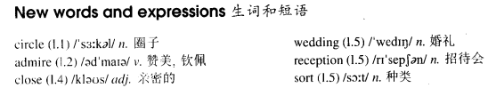

# Lesson 63

## Words

- circle admire close wedding reception sort humour sense

- 

## She was not amused

```
Jeremy Hampden has a large circle of friends and is very popular at parties. Everybody admires him for his great sense of humour - everybody, that is, except his six-year-old daughter, Jenny.

Recently, one of Jeremy's closest friends asked him to make a speech at a wedding reception. This is the sort of thing that Jeremy loves.

He prepared the speech carefully and went to the wedding with Jenny. He had included a large number of funny stories in the speech and, of course, it was a great success.

As soon as he had finished, Jenny told him she wanted to go home. Jeremy was a little disappointed by this but he did as his daughter asked.

On the way home, he asked Jenny if she had enjoyed the speech. To his surprise, she said she hadn't.

Jeremy asked her why this was so and she told him that she did not like to see so many people laughing at him!
```

## Whole

1. 文中 `Everybody admires him for his great sense of humour - everybody, that is, except his six-year-old daughter, Jenny` 这句话中的 `that is` 为插入语。有没有都不影响阅读理解

2. `a large circle of friends` 大的朋友圈。形容朋友很多

   ```
   When I was young, my parents would invite their small circle of friends.
   ```

3. `admire sb. for sth./doing sth.` 钦佩某人的某方面

   ```
   I really admire you for the work you do.

   I admire him for finishing such an unbelievable task.
   ```

4. `all sorts of...`, `all kinds of...` 各种类型

   ```
   I tell him all sorts of things about you.

   It's important for him to meet all kinds of people.
   ```

5. `sense of humour` 幽默感。`humour` 和 `humor` 一致

   ```
   I like people with a sense of humor.

   You used to have a sense of humour.
   ```

6. `make a speech` 演讲

   ```
   I want to make a speech at your wedding.

   He was so nervous that he didn't even make a speech at his own wedding.
   ```

7. `a large number of sth.` 大量的某物

   ```
   They might have sold a large number of cups last week.
   ```

8. `on the way home` 在回家的路上

   ```
   On the way home, they went through the park.
   ```

9. M: `as` 引导的 `方式状语从句`

   - 可以翻译为: `按照...的方式`

   - 和 `as` 类似的还有: `like`, `as if`, `as though`, `the way`...

   ```
   We must do as the doctor tells us.
   我们必须按照医生告诉我们的那样做

   When in Roma, do as the Romans do.
   在罗马，入乡随俗

   The children did as they were told.
   孩子们按照他们被告知的那样做了
   ```

## Exercises

```
The teacher's telling you to be quiet.

He's telling you to be quiet, too!
```

```
The teacher's telling you to take out your exercise books.

He's telling you to take them out, too!
```

```
The teacher's telling you to write out the exercise on page ninety.

He's telling you to write it out, too!
```

```
The teacher's telling you to copy down the words on the board.

He's telling you to copy them down, too!
```

```
The teacher's telling you to put away your books.

He's telling you to put them away, too!
```

```
She asked me to lend her a book.

I advise you not to lend her anything!
```

```
She asked me to fetch her a knife.

I advise you not to fetch her anything!
```

```
She asked me to lend her a camera.

I advise you not to lend her anything!
```

```
She asked him to bring her a glass.

I advise you not to bring her anything!
```

```
She asked them to buy her a present.

I advise you not to buy her anything!
```

```
Why don't they pay her?

He suggested that they should pay her.

I hope they won't pay her!
```

```
Why don't they produce that play?

He suggested that they should produce it.

I hope they won't produce it!
```

```
Why don't they punish him?

He suggested that they should punish him.

I hope they won't punish him!
```

```
Why don't they cut the tree down?

He suggested that they should cut it down.

I hope they won't cut it down!
```

```
Why don't they call a strike?

He suggested that they should call it.

I hope they won't call it!
```

```
You must stay!

He's still insisting that we should stay.

Oh, dear! His wife just warned me not to stay!
```

```
You must sign!

He's still insisting that we should sign the contract.

Oh, dear! His aunt just warned me not to sign!
```

```
You must refuse!

He's still insisting that we should refuse the money.

Oh, dear! His uncle just warned me not to refuse!
```

```
You must pay!

He's still insisting that we should pay the bill.

Oh, dear! His daughter just warned me not to pay!
```

```
You must leave!

He's still insisting that we should leave now.

Oh, dear! His wife just warned me not to leave!
```
