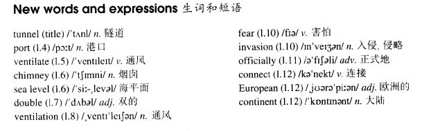

# Lesson 64

## Words

- tunnel port ventilate chimney level double ventilation fear invasion officially connect European continent

- 

## The Channel Tunnel!

```
In 1858, a French engineer, Aime Thome de Gamond, arrived in England with a plan for a twenty-one-mile tunnel under the English Channel.

He said that it would be possible to build a platform in the centre of the Channel. This platform would serve as a port and a railway station.

The tunnel would be well-ventilated if tall chimneys were built above sea level.

In 1860, a better plan was put forward by an Englishman, William Low. He suggested that a double railway-tunnel should be built.

This would solve the problem of ventilation, for if a train entered this tunnel, it would draw in fresh air behind it.

Forty-two years later a tunnel was actually begun. If, at the time, the British had not feared invasion, it would have been completed. The world had to wait almost another 100 years for the Channel Tunnel.

It was officially opened on March 7, 1994, finally connecting Britain to the European continent.
```

## Questions

1. ` This platform would serve as a port and a railway station` 中的 `as`

2. `The tunnel would be well-ventilated if tall chimneys were built above sea level` 但它并没有高于海平面？

3. ` for if a train entered this tunnel, it would draw in fresh air behind it.` 中的 `for if`，因此如果？ `draw` 抽出，吸出？

4. `If, at the time` 中的 `if`？ 因此？

## Whole

1. `sea level` 海平面

2. `above/below sea level` 海平面上/下

   ```
   The village is 1000 meters above sea level.

   The machine can't work at a depth of 10000 thousand meters below sea level.
   ```

3. `double check` 复查

   ```
   We need to double check his work.
   ```

4. `sb. fear that...` 某人恐怕某事会发生

   ```
   He fears that he will never see her again.
   ```

5. `serve as` 充当，当作

   ```
   It can also serve as a necklace.
   ```

6. `put forward a plan` 提出一个计划

   ```
   You must put forward a plan first and then talk to us.
   ```

7. `solve the problem of ...` 解决某个问题

   ```
   We won't get it under control, unless we solve the problem of ventilation.
   ```

8. `The tunnel would be well-ventilated if tall chimneys were built above sea level` 中的 `ventilated` 不作为被动处理，而是过去分词作定语

9. `draw in` 拉入；拉近

10. `it is possible to do sth.` 做某事是可行的

    ```
    Is it possible to get it under control?

    It's possible to learn English by yourself.DCF
    ```

11. M: `suggest that...should do sth.` 建议...做某事

    ```
    He suggested that she should get a job in a bank.

    He suggests that she get a job in a bank.
    // `should` 可以被省略，虽然省略了 `should`，但后面还是用原形 `get` 而不是 `gets`，因为 `should` 后面跟的是原形
    // 这句话是对的

    He suggested that she get a job in a bank.
    // `should` 被省略了，但因为 `should` 后跟的是原形，所以用 `get` 而不是 `got`
    // 这句话是对的

    He suggests that she gets a job in a bank.
    // 虽然用法是上面的用法，但实际应用中，也可以正常使用 `gets`
    // 这句话是对的

    He suggested that she got a job in a bank.
    // 虽然用法是上面的用法，但实际应用中，也可以正常使用 `got`
    // 这四句话都对
    ```

12. M: `与过去事实相反的虚拟语气`

    - 汉语中的虚拟语气

      ```
      如果我昨晚不那么累，我就会陪你出去走走。
      // 实际上昨晚我并没有出去走走，因为我很累
      // 说的是过去的事情

      当时如果在街上见到你，我会给你打招呼的。
      // 实际上我当时没见到你，所以也就没和你打招呼
      // 说的是过去的事情

      我们第一次相遇时如果你没有说出那句话，那我们就不会相识了。
      // 你当时说出了那句话，我们相识了
      // 说的是过去的事情
      ```

    - 含义

      1. 说的是过去发生的事情

      2. 实际发生的和说出来的话是相反的

    - 结构: `if 主语 had done..., 主语 would/could/might/should have done`

      ```
      If I had gone to the party last night, I would have met lots of people.
      如果我昨晚去参加派对，我会认识很多人
      // 实际上昨晚我并没有去，也就没有认识很对人。实际发生的和说出来的话是相反的

      I hadn't gone to the party. I haven't met lots of people.
      // 上一句基本就等同于这两句


      She would have sent a telegram if she hadn't received his letter.
      // 信收到了，就没有再使用电报去发信给他了


      I don't know what I would have done if you hadn't come back.
      // 你回来了
      ```

    - 变体: `if you could have done` = `if you had been able to do`

      ```
      If you had been able to speak to me the first time in the jungle, what would you have said?

      If you could have spoken to me the first time in the jungle, what would you have said?
      // 等价于上一句


      You know, I would have been a painter if I had been able to do anything.

      You know, I would have been a painter if I could have done anything.
      // 等价于上一句
      ```

    - `与现在事实相反的虚拟语气` & `与过去事实相反的虚拟语气`

      ```
      If I were hungry, I would eat something.
      如果我饿，我会吃点东西
      // 说的是现在。如果现在我饿
      // 现在没有饿，也就没有吃东西

      If I had been hungry, I would have eaten something.
      如果我饿，我会吃点东西
      // 说的是过去。如果当时我饿
      // 当时没有饿，也就没有吃东西
      ```

## Exercises

```
What a pity they couldn't meet Jack!

Yes, I'm sure they'd have liked him very much if they had met him.
```

```
What a pity they couldn't go to the concert!

Yes, I'm sure they'd have enjoyed it very much if they had gone to it.
```

```
What a pity they couldn't visit the museum!

Yes, I'm sure they'd have enjoyed it very much if they had visited it.
```

```
What a pity they couldn't hear the lecture!

Yes, I'm sure they'd have liked it very much if they had heard it.
```

```
What a pity they couldn't try her cooking!

Yes, I'm sure they'd have liked it very much if they had tried it.
```

```
She's made a mistake.

She wouldn't have made a mistake if she'd listened to me.
```

```
He's broken his arm.

He wouldn't have broken his arm if he'd been more careful.
```

```
I've lost my watch.

You wouldn't have lost your watch if you'd mended the strap.
```

```
They've failed the exam.

They wouldn't have failed the exam if they'd worked harder.
```

```
He's lost his reputation.

He wouldn't have lost his reputation if he'd taken my advice.
```

```
He had to work hard to pass the exam.

Yes, he wouldn't have passed it if he hadn't worked so hard.
```

```
He had to drive carefully to avoid an accident.

Yes, he wouldn't have avoided an accident if he hadn't driven so carefully.
```

```
He had to look hard to find the money.

Yes, he wouldn't have found it if he hadn't looked so hard.
```

```
He had to run fast to catch the thief.

Yes, he wouldn't have caught him if he hadn't run so fast.
```

```
He had to fight well to win the title.

Yes, he wouldn't have won it if he hadn't fought so well.
```

```
Why didn't you speak to Jack yesterday?

I'd have spoken to him if I could have found him!
```

```
Why didn't you enjoy the lecture yesterday?

I would have enjoyed it if I could have understood it!
```

```
Why didn't you arrest the thief yesterday?

I'd have arrested him if I could have caught him!
```

```
Why didn't you read the book yesterday?

I'd have read it if I could have borrowed it!
```

```
Why didn't you search the house yesterday?

I'd have searched it if I could have got into it!
```
