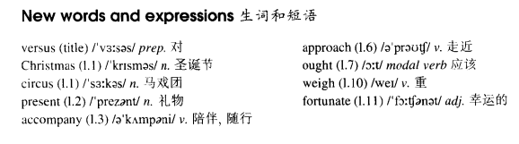

# Lesson 65

## Marks

1. `ought to do` = `should do` 应该做某事

2. `ought to have done` = `should have done` 本应该做某事，但却没有做

## Words

- versus Christmas circus present accompany approach ought weigh fortunate

- 

## Jumbo versus the police

```
Last Christmas, the circus owner, Jimmy Gates, decided to take some presents to a children's hospital.

Dressed up as Father Christmas and accompanies by a 'guard of honour' of six pretty girls, he set off down the main street of the city riding a baby elephant called Jumbo.

He should have known that the police would never allow this sort of thing. A policeman approached Jimmy and told him he ought to have gone along a side street as Jumbo was holding up the traffic.

Though Jimmy agreed to go at once, Jumbo refused to move. Fifteen policemen had to push very hard to get him off the main street. The police had a difficult time, but they were most amused.

'Jumbo must weigh a few tons,' said a policeman afterwards, 'so it was fortunate that we didn't have to carry him.'

'Of course, we should arrest him, but as he has a good record, we shall let him off this time.'
```

## Whole

1. `guard of honour` 仪仗队

   ```
   How many people is in the guard of honour?
   ```

2. `it is fortunate that...` 很幸运...

   ```
   It's fortunate that he wasn't caught by the storm.
   ```

3. `down the main street` 和 `along the main street` 一致。`down` 也可以表示 `沿着`

   ```
   The cat escaped quickly down the high wall.

   We had been walking together along the river before we had dinner.
   ```

4. `be dressed up as...`, `dressed up as...` 打扮成...样子

   ```
   You are dressed up as a woman.

   A guy dressed up as a dog.
   ```

5. `set off` 出发。和 `set out` 类似

   ```
   A small group of us set off to find a new home.
   ```

6. `hold up the traffic/line` 阻碍交通/阻碍排队。排队的时候像一条线一样，所以用 `line`

   ```
   Move man, you're holding up the line!

   The damaged car held up the traffic in that bridge.
   ```

7. `agree to do sth.` 同意去做某事

   ```
   He's agreed to visit you.
   // has done

   He agreed not to make a sound.
   ```

8. `let sb. off` 让某人离开

   ```
   It was you who let him off, not me!
   ```

9. `ought to do` = `should do`

   - 都表示 `应该做某事`。两者等价

   - `ought to do` 在实际应用的时候出现的频率较低

   ```
   The rabbit should eat the best carrot.

   The rabbit ought to eat the best carrot.
   // 和上一句等价


   The rabbit should not eat the best carrot.
   // 可以简写成 `shouldn't`

   The rabbit ought not to eat the best carrot.
   // 可以简写成 `oughtn't`
   // 否定句。和上一句等价


   Should the rabbit eat the best carrot?

   Ought the rabbit to eat the best carrot?
   // 一般疑问句。和上一句等价


   What should the rabbit eat?

   What ought the rabbit to eat?
   // 特殊疑问句。和上一句等价
   ```

10. `ought to have done` = `should have done`

    - 都表示 `本应该做某事，但却没有做`。两者等价

    - 说的是过去发生的事

    ```
    你错过了一场很精彩的派对，你本应该来参加的。
    // 实际上没有去参加
    ```

    ```
    The rabbit should have eaten the best carrot.
    // 本来应该吃的，实际上没有吃

    The rabbit ought to have eaten the best carrot.
    // 和上一句等价


    We lost the game yesterday, but we should have won.
    // 本来应该赢的，但没有赢，输了

    We lost the game yesterday, but we ought to have won.
    // 和上一句等价


    I should have told him the truth.

    I ought to have told him the truth.
    ```

## Exercises

```
Do you have to write that letter now?

I ought to write it, but I'm not going to!
```

```
Do you have to burn the rubbish now?

I ought to burn it, but I'm not going to!
```

```
Do you have to prepare your speech now?

I ought to prepare it, I'm not going to!
```

```
Do you have to light the fire now?

I ought to light it, but I'm not going to!
```

```
Do you have to pick the apple now?

I ought to pick it, but I'm not going to!
```

```
Do you think he should apologize?

It doesn't matter who apologizes, but someone's got to!
```

```
Do you think he should feed the horses?

It doesn't matter who feeds them, but someone's got to!
```

```
Do you think she should stop the traffic?

It doesn't matter who stops it, but someone's got to!
```

```
Do you think we should pay them?

It doesn't matter who pays them, but someone's got to!
```

```
Do you think he should call the police?

It doesn't matter who calls them, but someone's got to!
```

```
Why didn't you take a taxi last night?

I know I should have taken one, but I didn't think of it at the time.
```

```
Why didn't you order some wine last night?

I know I should have ordered some, but I didn't think of it at the time.
```

```
Why didn't you book some seats last night?

I know I should have booked some, but I didn't think of it at the time.
```

```
Why didn't you take some medicine last night?

I know I should have taken some, but I didn't think of it at the time.
```

```
Why didn't you wear a hat last night?

I know I should have worn one, but I didn't think of it at the time.
```

```
He ought to have arrived by now.

He had to change his plans, but he should be arriving soon.
// Q: `should be doing` 什么语法？
```

```
He ought to have told us the result by now.

He had to change his plans, but he should be telling us it soon.
```

```
He ought to have applied for the job by now.

He had to change his plans, but he should be applying for it soon.
```

```
He ought to have reached the airport by now.

He had to change his plans, but he should be reaching it soon.
```

```
He ought to have bought the goods by now.

He had to change his plans, but he should be buying them soon.
```
