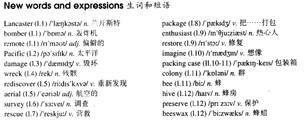

# Lesson 66

## Words

- Lancaster bomber remote Pacific damage wreck rediscover aerial survey rescue package enthusiast restore imagine colony bee hive preserve beeswax

- 

## Sweet as honey!

```
In 1963 a Lancaster bomber crashed on Wallis Island, a remote place in the South Pacific, a long way west of Samoa.

The plane wasn't too badly damaged, but over the years, the crash was forgotten and the wreck remained undisturbed.

Then in 1989. twenty-six years after the crash, the plane was accidentally rediscovered in an aerial survey of the island.

By this time, a Lancaster bomber in reasonable condition was rare and worth rescuing. The French authorities had the plane packaged and moved in parts back to France.

Now a group of enthusiasts are going to have the plane restored. It has four Rolls-Royce Merlin engines, but the group will need to have only three of them rebuilt.

Imagine their surprise and delight when they broke open the packing cases and found that the fourth engine was sweet as honey - still in perfect condition.

A colony of bees had turned the engine into a hive and it was totally preserved in beeswax!
```

## Questions

1. `a Lancaster bomber in reasonable condition was rare and worth rescuing` 一架还算可以的轰炸机是少见的，还值得挽救

2. `The French authorities had the plane packaged and moved in parts back to France` 中的 `had...packaged`。把...打包？

3. `Now a group of enthusiasts are going to have the plane restored` 中的 `have..restored`。把...复原？

4. `but the group will need to have only three of them rebuilt` 中的 `have...rebuilt` 把...修理

## Whole

1. `packing case` 包装箱；集装箱

2. `a long way west of Samoa` 萨摩亚西边很长的距离

3. `in reasonable condition` 在还算可以的状况下

4. 文中的 `moved in parts` 表示 `以小部分小部分地移动`。因为飞机已经被拆开了

5. `remote control` 遥控器

   ```
   He decides to have the remote control repaired by Jack.
   ```

6. `packaged food` 包装食品；速食

   ```
   I don't ever want to have packaged food anymore!
   ```

7. `it's hard to imagine` 很难想象

   ```
   It's hard to imagine that he actually failed in the fight.
   ```

8. `over the years` 在过去的数年间

   ```
   I have heard a lot about you over the years.
   ```

9. `in good/perfect/bad condition` 在好/完美/差的状况下

   ```
   My father forbids me to touch it, for he wants to keep it in perfect condition.
   ```

10. `be worth doing sth.` 值得做某事

    ```
    It is worth pointing out that he doesn't have a good reputation.
    值得一提的是，他没有好的名声

    I know it's not gonna be easy, but you said anything worth doing in difficult.
    ```

11. `turn A into B` 把 A 变成 B

    ```
    She agreed to turn me into a bird.

    It has been turned into liquid immediately.
    ```

12. `good heavens no!` 天啊，当然不是！

    ```
    Good heavens no! She hadn't certainly cleaned the car, she had it cleaned by that man.
    ```

13. 很多以 `c` 结尾的单词变成 `adv` 时，都额外加上 `ally`

    ```
    sympathetic
    sympathetically

    critic
    critically

    automatic
    automatically
    ```

14. `how nice your hair looks!` 你的头发看起来真好！感叹句

    - `how` 在这里是 `adv`，表示 `（强调程度）多么`

    ```
    How cute the cat looks!

    How interesting the game plays!
    ```

15. M: `have got to` = `have to` 不得不

    ```
    The poor panda has to set off along the side street.

    The poor panda has got to set off along the side street.
    // 和上一句等价


    It's the tallest man that had to leave from the stage.

    It's the tallest man that had got to leave from the stage.
    // 和上一句等价
    ```

16. M: `have something done` = `get something done`

    - 用法 1: `这件事当事人不做，让别人去做`

      ```
      I must have the parcel taken back home.
      我必须让人把包裹带回家
      // 当事人 `我` 不做这件事，让别人帮我把包裹带回家

      Jack will have the watch repaired on Saturday.
      周六他要让人修理以下他的表
      // 当事人 `Jack` 不做修理这件事，让别人帮他修

      I'm going to have my hair cut this afternoon.
      ```

    - 用法 2: `意外，不行的遭遇。` 可以翻译为 `被`。和 `被动语态` 一致

      ```
      Jack had his nose broken in a fight.
      Jack使他的鼻子在一次打架中被打破了

      I had my bag stolen.
      我使我的包被偷了


      Have you ever had your bike stolen?
      你曾经使你的自行车被偷过吗？

      Yes, I have ever had my bike stolen.
      ```

    - 与时态结合

      ```
      I had my hair cut yesterday.

      We are having the house painted this week.

      I'm going to have my hair cut this afternoon.

      He has his hair cut every month.
      ```

## Exercises

```
Did she make the cake herself?

Good heavens no! She had it made in town.
```

```
Did you sharpen those knives yourself?

Good heavens no! I had them sharpened in town.
```

```
Did he translate the article himself?

Good heavens no! He had it translated in town.
```

```
Did they clean their coats themselves?

Good heavens no! They had them cleaned in town.
```

```
Did she make the curtains herself?

Good heavens no! She had them made in town.
```

```
How nice your hair looks!

Thank you. I've just had it cut.
```

```
How nice your kitchen looks!

Thank you. I've just had it painted.
```

```
How nice your house looks!

Thank you. I've just had it redecorated.
```

```
How nice your furniture looks!

Thank you. I've just had it installed.
```

```
How nice his roses look!

Thank you. He has just had them sprayed.
```

```
You'll need some photos for your passport.

I'll have some taken next week.
```

```
You'll need some gas fires for the winter.

I'll have some installed next week.
```

```
You'll need some warm boots for the journey.

I'll have some made next week.
```

```
You'll need some safety belts for your car.

I'll have some put in next week.
```

```
You'll need some tables for the meeting.

I'll have some sent round next week.
```

```
He says he has got to clean his suit.

He can't clean it himself! Why doesn't he have it cleaned?
```

```
She says she's got to lay the carpet.

She can't lay it herself! Why doesn't she have it laid?
```

```
They say they've got to test the engine.

They can't test it themselves! Why don't they have it tested?
```

```
He says he's got to cut the trees down.

He can't cut them down himself! Why doesn't he have them cut down?
```

```
He says he's got to rebuild the garage.

He can't rebuild it himself! Why doesn't he have it rebuilt?
```
