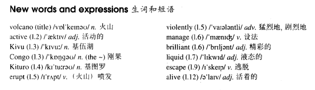

# Lesson 67

## Words

- volcano active Kivu Congo Kituro erupt violently manage brilliant liquid escape alive

- 

## Volcanoes

```
Haroun Tazieff, the Polish scientist, has spent his lifetime studying active volcanoes and deep caves in all parts of the world.

In 1948, he went to Lake Kivu in the Congo to observe a new volcano which he later named Kituro. Tazieff was able to set up his camp very close to the volcano while it was erupting violently.

Though he managed to take a number of brilliant photographs, he could not stay near the volcano for very long.

He noticed that a river of liquid rock was coming towards him. It threatened to surround him completely, but Tazieff managed to escape just in time.

He waited until the volcano became quiet and he was able to return two days later. This time, he managed to climb into the mouth of Kituro so that he could take photographs and measure temperatures.

Tazieff has often risked his life in this way. He has been able to tell us more about active volcanoes than any man alive.
```

## Questions

1. `Tazieff was able to set up his camp very close to the volcano while it was erupting violently.` 把他的营地扎在非常靠近火山，当它喷发的时候

2. `managed to`

## Whole

1. `what a brilliant idea` 这主意太棒了

2. `liquid rock` 岩浆

3. `after all` 最终，终于

   ```
   He saw her after all.
   ```

4. `managed to do sth.` 过去成功做了某事

   - 用法 1: 和 `was able to do sth.` 含义和用法一致

     ```
     The fire spread quickly, but everyone was able to escape.

     The fire spread quickly, but everyone managed to escape.
     // 和上一句等价


     They didn't want to come with us at first, but we were able to persuade them.

     They didn't want to come with us at first, but we managed to persuade them.
     // 和上一句等价


     I wasn't able to swim to the other side of the river.

     I didn't manage to swim to the other side of the river.
     // 和上一句等价
     ```

   - 四句型

     ```
     The rabbit managed to eat the carrot.

     The rabbit didn't manage to eat the carrot.

     Did the rabbit manage to eat the carrot?

     What did the rabbit manage to eat?
     ```

   - 时态

     ```
     The rabbit has managed to eat the carrot.

     The rabbit had managed to eat the carrot.
     ```
