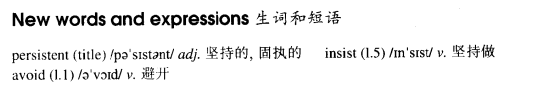

# Lesson 68

## Words

- persistent avoid insist

- 

## Persistent

```
I crossed the street to avoid meeting him, but he saw me and came running towards me. It was no use pretending that I had not seen him, so I waved to him.

I never enjoy meeting Nigel Dykees. He never has anything to do. No matter how busy you are, he always insists on coming with you.

I had to think of a way of preventing him from following me around all morning.

'Hello, Nigel,' I said. 'Fancy meeting you here!'

'Hi, Elizabeth,' Nigel answered. 'I was just wondering how to spend the morning - until I saw you. You're not busy doing anything, are you?'

'No, not at all,' I answered. 'I'm going to...'

'Would you mind my coming with you?' he asked, before I had finished speaking.

'Not at all,' I lied, 'but I'm going to the dentist.'

'Then I'll come with you,' he answered. 'There's always plenty to read in the waiting room!'
```

## Whole

1. 文中 `he saw me and came running towards me` 可以分成几句话

   ```
   He saw me and came.

   He is running towards me.
   // `running towards me` 实际上是分词作了状语
   ```

2. `avoid doing sth.` 避免做某事

   ```
   I've noticed that you tried to avoid meeting me recently.
   ```

3. `insist on doing sth.` 坚持做某事

   ```
   Even though he was very sick that winter, he insisted on writing his new book.
   ```

4. `it is no use pretending that...` 假装某件事是没有用的

   ```
   It's no use pretending that you want to help me.
   假装你想帮我这件事是没用的，我不吃这一套

   It's no use pretending that you love me.
   装成爱我这件事是没用的，别装了
   ```

5. `prevent sb. from doing sth.` 阻止某人做某事

   ```
   Nothing could prevent me from sticking to my plan.
   ```

6. `fancy meeting you here` 想不到在这里见到你

   ```
   Fancy meeting you again.
   ```

7. 有些动词后面跟的是动名词，有些动词后面跟的又是介词如 `on`， `in` 等，可能跟这个单词是及物动词还是不及物动词有关

   - 及物动词。这意味着它需要一个直接宾语来完成句子的意思

     ```
     avoid meeting him.

     enjoy reading.
     ```

   - 不及物动词。

     ```
     insist on doing sth.
     ```

8. `enjoy doing sth.` 享受做某事

   ```
   I enjoy reading every night before I go to bed.
   ```

9. `follow sb. around` 跟在某人身边

   ```
   She insisted on following me around yesterday.
   ```

10. `finish doing sth.` 完成做某事

    ```
    Have you finished reading the book?
    ```

11. `I was wondering...` 我想知道....。类似于 `I wonder to know`

    - 这个句子可以在面对面说话时用。它看上去虽然符合过去进行时，但它表示的是 `此时此刻`

    - 比起 `think of` 更礼貌一点

    ```
    I was wondering if you could help me.
    呃，我想你是否可以帮我一下？

    I was wondering, do you happen to know anything about July?
    ```

12. M: `动名词的逻辑主语`

    - 小知识点，不是很重要

    ```
    Do you mind my smocking?
    你介意我抽烟吗？
    // `smocking` 为动名词，它的主语是 `I`
    // 比较正式的用法

    Do you mind me smocking?
    你介意我抽烟吗？
    // 非正式用法，但也可以用


    Would you mind telling me the whole story?
    你介意告诉我整个故事吗？

    Would you mind Tom's telling us the whole story?
    你介意Tom告诉我们整个故事吗？
    ```

13. M: `no matter who/what/how/where/when/whose/which` 让步状语从句

    - 可以翻译为: `无论；不管`。`无论是谁/无论是什么/无论怎样/无论在哪/无论什么时候/无论是谁的/无论是哪一个`

    ```
    I'll love you no matter what you do.
    我都会爱你，无论你做什么

    No matter where you go, I'll follow you around.
    不管你去哪，我都会跟在你身边

    Call me when you arrive, no matter how late it is.
    当你到达时，不管多晚都给我打个电话
    ```
