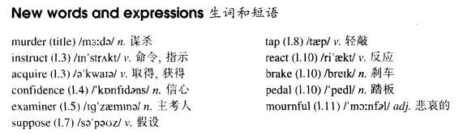

# Lesson 69

## Words

- murder instruct acquire confidence examiner suppose tap react brake pedal mournful

- 

## But not murder!

```
I was being tested for a driving licence for the third time. I had been asked to drive in heavy traffic and had done so successfully.

After having been instructed to drive out of town, I began to acquire confidence. Sure that I had passed, I was almost beginning to enjoy my test.

The examiner must have been pleased with my performance, for he smiled and said, 'Just one more thing, Mr.Eames. Let us suppose that a child suddenly crosses the road in front of you.'

'As soon as I tap on the window, you must stop within five feet.' I continued driving and after some time, the examiner tapped loudly.

Though the sound could be heard clearly, it took me a long time to react. I suddenly pressed the brake pedal hard and we were both thrown forward.

The examiner looked at me sadly. 'Mr. Eames,' he said, in a mournful voice, 'You have just killed that child!'
```

## Questions

2. `for he smiled and said` 的 `for`, 所以?

## Whole

1. `be instructed to do sth.` 被吩咐去做某事

   ```
   I'm instructed to tell you, if you insist on doing this, he will murder you.
   ```

2. `let's suppose that...` 让我们假设...

   ```
   Let's suppose that he insists on doing this.
   ```

3. `tap on the window` 敲玻璃

   ```
   After I tapped on the window, the bird just flew away.
   ```

4. `vacant post` 空缺的职位

5. M: `having been done`

   - 完成被动

   - 和 `分词作状语` 的变换规则一致

   ```
   After I had been instructed to drive out of town, I began to acquire confidence.

   After having been instructed to drive out of town, I began to acquire confidence.
   在被告知开出小镇后，我开始有了信心
   // 根据 `分词作状语` 的变换规则，由上一句话得到这句话
   // 和上一句等价


   After he had been told many times, he finally understood it.

   Having been told many times, he finally understood it.
   // `after` 也可以去掉


   After the fish had been caught by the fisherman, the fish died very soon.

   Having been caught by the fisherman, the fish died very soon.
   ```

## Exercises

```
Did the man confess?

Yes, but only after being arrested!
```

```
Did the man leave the restaurant?

Yes, but only after being thrown out!
```

```
Did the man give up the argument?

Yes, but only after being knocked out!
```

```
Did the man become well known?

Yes, but only after being murdered!
```

```
Did the man call the guard?

Yes, but only after being robbed!
```

```
He became famous after his murder.

Oh no! He became famous before being murdered.
```

```
He killed the guard after his arrest.

Oh no! He killed him before being arrested.
```

```
He fell down after his attack.

Oh no! He fell down before being attacked.
```

```
He saw Tom after his interview.

Oh no! He saw him before being interview.
```

```
He became rich after his election.

Oh no! He became rich before being elected.
```

```
When do you want the fax sent to Hong Kong?

It should be sent some time today.
```

```
When do you want the books taken to the library?
// Q: `do...done` 是什么语法? 为什么 `When do you want the books took to the library?` 是错误的?

It should be taken some time today.
```

```
When do you want the goods delivered to the shop?

It should be delivered some time today.
```

```
When do you want the luggage fetched from the hotel?

It should be fetched some time today.
```

```
When do you want the result announced to the Press?

It should be announced some time today.
```

```
I'd like to ask you about your report.

Not again! I was being asked about my report all day yesterday!
```

```
I'd like to ask you our sales figures.

Not again! I was being asked our sales figures all day yesterday!
```

```
I'd like to interview you your latest film.

Not again! I was being interviewed my latest film all day yesterday!
```

```
I'd like to remind you the need for economy.

Not again! I was being reminded the need for economy all day yesterday!
```

```
I'd like to inform you the firm's future plans.

Not again! was being informed the firm's future plans all day yesterday!
```
