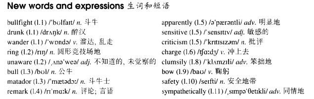

# Lesson 70

## Words

- bullfight drunk wander ring unaware bull matador remark apparently sensitive criticism charge clumsily bow safety sympathetically

- 

## Red for danger

```
During a bullfight, a drunk suddenly wandered into the middle of the ring. The crowd began to shout, but the drunk was unaware of the danger.

The bull was busy with the matador at the time, but it suddenly caught sight of the drunk who was shouting rude remarks and waving a red cap.

Apparently sensitive to criticism, the bull forgot all about the matador and charged at the drunk.

The crowd suddenly grew quiet. The drunk, however, seemed quite sure of himself.

When the bull got close to him, he clumsily stepped aside to let it pass. The crowd broke into cheers and the drunk bowed.

By this time, however, three men had come into the ring and they quickly dragged the drunk to safety.

Even the bull seemed to feel sorry for him, for it looked on sympathetically until the drunk was out of the way before once more turning its attention to the matador.
```

## Questions

1. `sensitive to criticism` 敏感的批评?

2. `seemed quite sure of himself` 看起来非常相信他自己

3. `The crowd broke into cheers and the drunk bowed.` 人群由安静变成欢呼

4. `once more turning its attention to the matador`

## Whole

1. 文中 `apparently sensitive to criticism, the bull forgot all about the matador and charged at the drunk` 这句话是分词作状语

   ```
   The bull apparently was sensitive to criticism, the bull forgot all about the matador and charged at the drunk.
   ```

2. `be unaware of...` 没有觉察；没有了解

   ```
   Unaware of that, she just wandered into the tunnel by herself.
   ```

3. `be aware of...` 觉察到；了解到

   ```
   Although he was aware of its danger, he still insisted on doing that.
   ```

4. `be sensitive about sth.` 对某事很敏感

   ```
   I know you are sensitive about fish, I've already taken them away.
   ```

5. `accept sb.'s criticism` 接受某人的批评

   ```
   You're the only one who accepts my criticism.
   ```

6. `charge at sb.` 冲向某人。有进攻性地冲过去，和 `attack` 类似

   ```
   The man was instructed to charge at the enemy.
   ```

7. `for your safety` 为了你的安全起见

   ```
   For your safety, please remain inside the room.
   ```

8. `be busy with sth.` 忙于某事

   ```
   Finding that Jack was busy with his work, he continued doing his own work.
   ```

9. `at the time` 在那时。过去的时间

   ```
   I tried to write you a letter at the time.
   ```

10. `catch sight for sth.` 突然间瞥到了某物。类似于 `glimpse for a moment`, `suddenly notice`

    ```
    I've been here for hours so that I can catch sight for her.

    I caught sight for her in the crowd last night.
    ```

11. `grow quiet/nervous/dark` 变得安静/紧张/暗

    ```
    As it grew dark, they set up the camp.

    I want to grow old with her, I love her.
    ```

12. `get close to sth.` 接近某物

    ```
    If you had known what would happen to you, when you get too close to me, you wouldn't have done that.
    ```

13. `step aside` 站在旁边

    ```
    You need to know when to step aside.
    ```

14. `break into cheers` 欢呼

    ```
    Having been told the news, they broke into cheers.
    ```

15. `feel sorry for sb.` 觉得某人可怜，值得同情。并不是说我做了什么对不起某人的事，只是觉得他可怜，值得同情

    ```
    He was fired last night, I feel sorry from him.
    昨晚他被开除了，我很同情他
    ```

16. `look on` 旁观

    ```
    They just looked on and did nothing.
    ```

17. `get out of the way` 不挡道

    ```
    I'm not so pleased with you, for you asked me to get out of the way.
    我对你不是很满意，因为你跟我说别挡道
    // 类似于心情不好时说 `滚开`
    ```

18. `turn sb.s attention to sth.` 转移某人的注意力到某物上

    ```
    Jack ordered me to turn my attention to him.
    ```

19. `once more` 再一次

    ```
    I have to remind you of that once more.
    ```
