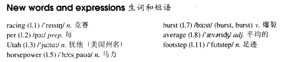

# Lesson 72

## Words

- racing per Utah horsepower burst average footstep

- 

## A car called Bluebird

```
The great racing driver, Sir Malcolm Campbell, was the first man to drive at over 300 miles per hour.

He set up a new world record in September 1935 at Bonneville Salt Flats, Utah.

Bluebird, the car he was driving, had been specially built for him. It was over 30 feet in length and had a 2500 - horsepower engine.

Although Campbell reached a speed of over 304 miles per hour, he had great difficulty in controlling the car because a tyre burst during the first run.

After his attempt, Campbell was disappointed to learn that his average speed had been 299 miles per hour.

However, a few days later, he was told that a mistake had been made. His average speed had been 301 miles per hour.

Since that time, racing drivers have reached speeds over 600 miles an hour.

Following in his father's footsteps many years later, Sir Malcolm's son, Donald, also set up a world record. Like his father, he was driving a car called Bluebird.
```

## Whole

1. `racing driver/car` 赛车手/赛车

   ```
   This car takes its name from a great racing driver.
   ```

2. `burst into tears` 突然大哭

   ```
   I used to burst into tears for no reason at all.
   ```

3. `follow in sb.'s footsteps` 追随某人的脚步。子承父业，继承某人的衣钵

   ```
   Why didn't you follow in your father's footsteps and keep the restaurant open?
   ```

4. `have difficulty in doing sth.` 做某事有困难

   ```
   I had a great difficulty in persuading him to go with me.
   ```

5. `be disappointed to learn that...` 很失望地得知了某事

   ```
   We were disappointed to learn that the picnic had been cancelled.
   ```
