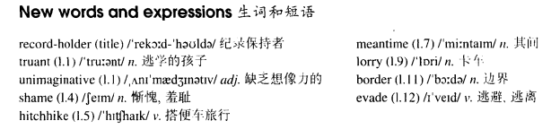

# Lesson 73

## Words

- truant unimaginative shame hitchhike meantime lorry border evade

- 

## The record-holder

```
Children who play truant from school are unimaginative. A quiet day's fishing, or eight hours in a cinema seeing the same film over and over again, is usually as far as they get.

They have all been put to shame by a boy who, while playing truant, travelled 1600 miles.

He hitchhiked to Dover and, towards evening, went into a boat to find somewhere to sleep. When he woke up next morning, he discovered that the boat had, in the meantime, travelled to Calais. No one noticed the boy as he crept off.

From there, he hitchhiked to Paris in a lorry. The driver gave him a few biscuits and a cup of coffee and left him just outside the city.

The next car the boy stopped did not take him into the centre of Paris as he hoped it would, but to Perpignan on the French-Spanish border.

There he was picked up by a policeman and sent back to England by the local authorities. He has surely set up a record for the thousands of children who dream of evading school.
```

## Questions

1. `as he hoped it would, but to Perpignan on the French-Spanish border`

## Whole

1. `record holder` 记录保持者

2. `play truant` 逃学

3. `be put to shame` = `put sb. to shame` 使某人相形见绌，表示相比之下没有那么好

   ```
   Your cooking puts me to shame.
   // 你的厨艺太好了，和我的相比，我的厨艺差得多了。使我相形见绌

   I'm fairly confident that every students were put to shame by this.
   ```

4. `shame on you` 你太丢脸了

   ```
   Shame on you for not giving this to me sooner.
   ```

5. `hitchhike to sw.` 搭便车去某地

   ```
   He insisted on hitchhiking to his hometown.
   ```

6. `in the meantime` 与此同时

   ```
   In the meantime, he was busy with his homework.
   ```

7. `over and over again` 一次又一次

   ```
   Because you were unaware of it, you did that to me over and over again.
   ```

## Exercises

```
What was he doing when he found him?

He was looking for somewhere to sleep.
```

```
What was he doing when he met him?

He was looking for someone to talk with.
```

```
What was he doing when he met them?

He was looking for something to read.
```

```
What was he doing when he saw her?

He was looking for somewhere to hide.
```

```
What was he doing when he found him?

He was looking for someone to play with.
```

```
Oh dear! You've burnt your arm!

Yes, I've burnt it when I was ironing.
```

```
Oh dear! You've broken the vase!

Yes, I've broken it when I was dusting the shelf.
```

```
Oh dear! You've lost a glove!

Yes, I've lost it when I was chasing a thief.
```

```
Oh dear! You've torn your trousers!

Yes, I've torn it when I was climbing a tree.
```

```
Oh dear! You've hurt your leg!

Yes, I've hurt it when I was playing football.
```

```
She hasn't worn that dress before.

Yes, she has. It's the dress she wore for the picnic last month.
```

```
He hasn't read that magazine before.

Yes, he has. It's the magazine he read in hospital last month.
```

```
He hasn't spoken to that girl before.

Yes, he has. It's the girl he spoke on the telephone last month.
```

```
She hasn't seen that film before.

Yes, she has. It's the film she saw in London last month.
```

```
She hasn't heard that joke before.

Yes, she has. It's the joke she heard on the radio last month.
```

```
How did you get to Paris?

I got there in a lorry.
```

```
How did you get to the house?

I got there on foot.
```

```
How did you get to Canada?

I got there by plane.
```

```
How did you get to the island?

I got there by swimming.
```

```
How did you get to the village?

I got there by helicopter.
```
