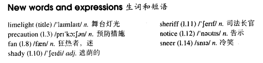

# Lesson 74

## Words

- limelight precaution fan shady sheriff notice sneer

- 

## Out of the limelight

```
An ancient bus stopped by a dry river bed and a party of famous actors and actresses got off.

Dressed in dark glasses and old clothes, they had taken special precautions so that no one should recognize them. But as they soon discovered, disguises can sometimes be too perfect.

'This is a wonderful place for a picnic,' said Gloria Gleam. 'It couldn't be better, Gloria,' Brinksley Meers agreed. 'No newspaper men, no film fans! Why don't we come more often?'

Meanwhile, two other actors, Rockwall Slinger and Merlin Greeves, had carried two large food baskets to a shady spot under some trees. When they had all made themselves comfortable, a stranger appeared. He looked very angry.

'Now you get out of here, all of you!' he shouted. 'I'm sheriff here. Do you see that notice? It says "No Camping" - in case you can't read!'

'Look, sheriff,' said Rockwall, 'don't be too hard on us. I'm Rockwall Slinger and this is Merlin Greeves.' 'Oh, is it?' said the sheriff with a sneer. 'Well, I'm Brinksley Meers, and my other name is Gloria Gleam. Now you get out of here fast!'
```

## Questions

1. `But as they soon discovered` 中的 `as`

2. `in case you can't read` 中的 `in case` 显然？

## Whole

1. 文中的 `you can't read` 可以翻译为 `你不识字`

2. `take precaution` 采取预防措施

   ```
   We should have taken great precautions.
   ```

3. `be a fan of sb's` 某人的粉丝

   ```
   I never did tell you about my son, did I? He is a big fan of yours.
   ```

4. `on such short notice` 如此短暂的通知

   ```
   Thank you for coming on such short notice.
   // 在这么临时地通知下你还能这么快地赶过来

   I just wanted to say thank you for meeting me on such short notice.
   ```

5. `with a sneer` 嘲笑

   ```
   'You probably wouldn't understand,' he said with a sneer.
   ```

6. `sneer at sb.` 嘲笑某人

   ```
   He sneered at me like everyone else.
   ```

7. `a party of...` 一群人

   ```
   A party of young men are responsible for this.
   ```

8. `carry sth. to sw.` 携带某物去某地

   ```
   Why don't you carry this table to our yard?
   ```

9. `make oneself comfortable` 让某人舒服

   ```
   Please come in and make yourself comfortable.
   ```

10. `don't be too hard on sb.` 不要对某人太强硬/严厉

    ```
    If I were you, I wouldn't be too hard on myself.
    ```

11. `deal with sth.` 处理某事

    ```
    I'll deal with that situation as soon as I get out of here.
    ```

12. `get out of here` 远离这里

    ```
    We should have got out of here.
    ```

## Exercises

```
Why aren't you wearing your glasses?

Because I hate wearing them.


Why aren't you polishing the car?

Because I don't like polishing it.


Why aren't you drying the dishes?

Because I dislike drying them.


Why aren't you talking to Frank?

Because I hate talking to him.


Why aren't you watching football?

Because I don't enjoy watching it.
```

```
Jack always wears glasses.

Are you sure? He isn't wearing any today.


Jack always smokes a cigar.

Are you sure? He isn't smoking any today.


Jack always wears gloves.

Are you sure? He isn't wearing any today.


Jack always buys cigarettes here.

Are you sure? He isn't buying any today.


Jack always takes a taxi.

Are you sure? He isn't taking any today.
```

```
I'm using your pen. Do you mind?

No, it's all right. I don't need it just now.

Yes, I do. I want to use it myself.


I'm using your hammer. Do you mind?

No, it's all right. I don't need it just now.

Yes, I do. I want to use it myself.


I'm using your dictionary. Do you mind?

No, it's all right. I don't need it just now.

Yes, I do. I want to use it myself.


I'm using your ladder. Do you mind?

No, it's all right. I don't need it just now.

Yes, I do. I want to use it myself.


I'm using your mirror. Do you mind?

No, it's all right. I don't need it just now.

Yes, I do. I want to use it myself.
```

```
What's she doing?

I don't know what she's doing. I can't see anything.


What's she talking about?

I don't know what she's talking about. I can't hear anything.


What's she burning?

I don't know what she's burning. I can't smell anything.


What's she writing?

I don't know what she's writing. I can't see anything.


What are we eating?

I don't know what we're eating. I can't taste anything.
```
