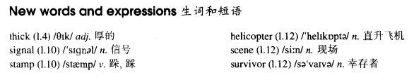

# Lesson 75

## Words

- thick signal stamp helicopter scene survivor overhead

- 

## SOS

```
When a light passenger plane flew off course some time ago, it crashed in the mountains and its pilot was killed. The only passengers, a young woman and her two baby daughters, were unhurt.

It was the middle of the winter. Snow lay thick on the ground. The woman knew that the nearest village was miles away.

When it grew dark, she turned a suitcase into a bed and put the children inside it, covering them with all the clothes she could find.

During the night, it got terrible cold. The woman kept as near as she could to the children and even tried to get into the case herself, but it was too small.

Early next morning, she heard planes passing overhead and wondered how she could send a signal. Then she had an idea. She stamped out the letters 'SOS' in the snow.

Fortunately, a pilot saw the signal and sent a message by radio to the nearest town. It was not long before a helicopter arrived on the scene to rescue the survivors of the plane crash.
```

## Questions

1. `The woman kept as near as she could ` 保持尽可能近的距离

## Whole

1. 文中的 `snow lay thick` 的 `lay` 的原型 `lie` 可表示 `保持某种状态`。所以可以翻译为 `雪很厚`

2. `send a signal` 发送信号

   ```
   It's impossible for us to send a signal in this thick fog day.
   ```

3. `stamp out` 踩灭

   ```
   I saw you stamp out the fire.
   ```

4. `arrive on the scene` 抵达现场

   ```
   Before the police arrived on the scene, they had already escaped.
   ```

5. `fly off course` 偏离航线

   ```
   No matter what happens, you shouldn't fly off course.
   ```

6. `cover sth. with A` 用 A 覆盖某物

   ```
   If you had covered yourself with a blanket, you wouldn't have got a cold.
   ```

7. `get adj.` 变得...

   ```
   Let's hope she gets better soon.

   It's getting dark.
   ```

8. `it was not long before...` 不久后，某事发生了

   ```
   It was not long before he broke the record.
   ```

## Exercises

```
Did he really enter for a race?

He entered for several and he even won one!
```

```
Did he really write a story?

He wrote for several and he even published one!
```

```
Did he really see a murderer?

He saw for several and he even arrested one!
```

```
Did he really design a boat?

He designed for several and he even built one!
```

```
Did he really take an exam?

He took for several and he even got through one!
```

```
Why did you punish that boy yesterday?

I didn't punish him. No one did.
```

```
Why did you break the window yesterday?

I didn't break it. No one did.
```

```
Why did you invite those people yesterday?

I didn't invite them. No one did.
```

```
Why did you accept his excuse yesterday?

I didn't accept it. No one did.
```

```
Why did you steal the money yesterday?

I didn't steal it. No one did.
```

```
You look hot. What've you been doing?

I went climbing this morning and got very hot.
```

```
You look sunburnt. What've you been doing?

I went walking this morning and got very sunburnt.
```

```
You look dirty. What've you been doing?

I went riding this morning and got very dirty.
```

```
You look excited. What've you been doing?

I went sailing this morning and got very excited.
```

```
You look hungry. What've you been doing?

I went skiing this morning and got very hungry.
```

```
Did you remember to thank your host?

Yes. I thanked him as politely as I could.
```

```
Did you remember to deliver my message?

Yes. I delivered it as quickly as I could.
```

```
Did you remember to wrap up the parcel?

Yes. I wrapped it up as carefully as I could.
```

```
Did you remember to take back my library book?

Yes. I took it back as soon as I could.
```

```
Did you remember to tidy up your room?

Yes. I tidied it up as well as I could.
```
