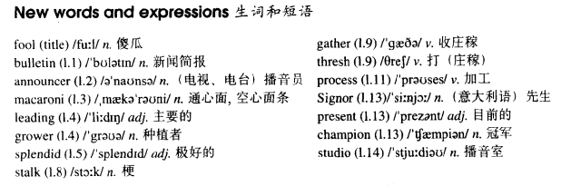

# Lesson 76

## Words

- fool bulletin announcer macaroni leading grower splendid stalk gather thresh process Signor present champion studio

- 

## April Fool's Day

```
'To end our special news bulletin,' said the voice of the television announcer, 'we're going over to the macaroni fields of Calabria. Macaroni has been grown in this area for over six hundred years.'

'Two of the leading growers, Guiseppe Moldova and Riccardo Brabante, tell me that they have been expecting a splendid crop this year and harvesting has begun earlier than usual.'

'Here you can see two workers who, between them, have just finished cutting three cartloads of golden brown macaroni stalks. The whole village has been working day and night gathering and threshing this year's crop before the September rains.'

'On the right, you can see Mrs. Brabante herself. She has been helping her husband for thirty years now. Mrs. Brabante is talking to the manager of the local factory where the crop is processed.'

'This last scene shows you what will happen at the end of the harvest: the famous Calabrian macaroni - eating competition! Signor Fratelli, the present champion, has won it every year since 1991.'

'And that ends our special bulletin for today, Thursday, April 1st. We're now going back to the studio.'
```

## Questions

1. `have just finished cutting three cartloads` 的 `have done doing` 是时态还是 `cutting` 是动名词？

## Whole

1. 文中开头的 `to end` 表示 `来结束`

2. 文中 `going over to` 是电视播报的术语，表示 `将画面交给...`

3. `April Fool's Day` 愚人节

4. `bulletin board` 布告栏

   ```
   The bulletin board was covered with messages.
   ```

5. `leading cause` 主要原因

   ```
   Breast cancer is the leading cause of death for American women in their forties.
   ```

6. `splendid idea/example/view/garden` 极好的主意/例子/观点/花园

   ```
   What a splendid idea!
   ```

7. `whatever for` 询问出于什么原因

   ```
   He was late for the meeting.

   Whatever for?
   为什么他迟到？
   ```

8. `at the end of...` 在...的最后

   ```
   Always ask yourself at the end of the day, 'What did I manage to do today?'
   ```

## Exercises

```
He's growing a beard.

Whatever for? He hasn't grown one before, has he?
```

```
He's employing a secretary.

Whatever for? He hasn't employed one before, has he?
```

```
He's giving a speech.

Whatever for? He hasn't given one before, has he?
```

```
He's building a garage.

Whatever for? He hasn't built one before, has he?
```

```
He's having an operation.

Whatever for? He hasn't had one before, has he?
```

```
What do you think of his beard?

It's all right, but he hasn't been growing it for long, has he?
```

```
What do you think of my violin?

It's all right, but you haven't been playing it for long, have you?
```

```
What do you think of his glasses?

It's all right, but he hasn't been wearing it for long, has he?
```

```
What do you think of my camera?

It's all right, but you haven't been using it for long, has he?
```

```
What do you think of their work?

It's all right, but they haven't been doing it for long, have they?
```

```
He's been telephoning me all morning.

Don't exaggerate! He's only telephoned you twice.
```

```
He's been interrupting me all morning.

Don't exaggerate! He's only interrupted you twice.
```

```
He's been shouting at mee all morning.

Don't exaggerate! He's only shouted at you twice.
```

```
He's been ringing the doorbell all morning.

Don't exaggerate! He's only rung it twice.
```

```
He's been asking me for coffee all morning.

Don't exaggerate! He's only asked you for it twice.
```

```
Have you been reading magazines all the time I've been away?

No, I haven't read any since you left.
```

```
Have you been smoking cigarettes all the time I've been away?

No, I haven't smoked any since you left.
```

```
Have you been eating chocolates all the time I've been away?

No, I haven't ate any since you left.
```

```
Have you been painting pictures all the time I've been away?

No, I haven't painted any since I left.
```

```
Have you been answering questions all the time I've been away?

No, I haven't answered any since you left.
```
