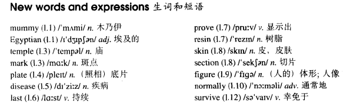

# Lesson 77

## Words

- mummy Egyptian temple mark plate disease last prove resin skin section figure normally survive

- 

## A successful operation

```
The mummy of an Egyptian woman who died in 800 B.C has just had an operation. The mummy is that of Shepenmut who was once a singer in the Temple of Thebes.

As there were strange marks on the X-ray plates taken of the mummy, doctors have been trying to find out whether the woman died of a rare disease. The only way to do this was to operate.

The operation, which lasted for over four hours, proved to be very difficult because of the hard resin which covered the skin. The doctors removed a section of the mummy and sent it to a laboratory.

They also found something which the X-ray plates did not show: a small wax figure of the god Duamutef. This god which has the head of a cow was normally placed inside a mummy.

The doctors have not yet decided how the woman died. They feared that the mummy would fall to pieces when they cut it open, but fortunately this has not happened. The mummy successful survived the operation.
```

## Questions

1. `The mummy is that of Shepenmut` 中的 `is that`

## Whole

1. `B.C.` 公元前。 `before Christ` 的简写。西方把耶稣出生的那天定为公元元年

2. `a rare disease` 罕见的疾病

   ```
   If we get a rare disease from this water, at least we'll all die together.
   ```

3. `prove to be...` 证实为...

   ```
   It proved to be more difficult that I originally thought it would be.
   ```

4. `a section of sth.` 某物的一部分

   ```
   This takes its name from a section from your body, and guess which part?
   ```

5. `have an operation` 手术

   ```
   She must have been having an operation at the time.
   ```

6. `died of...` 死于...。后面往往跟的是一种疾病

   ```
   He died of cancer before he was able to pay a visit to his hometown.
   ```

7. `fall to pieces` 物理意义上的变成碎片，也可以情绪上或心理上，表示 `人崩溃了，人变成了碎片，丧失理智了`

   ```
   The old map fell to pieces in my hands.

   When he heard the bad news, he just fell to pieces.
   ```

8. `cut it open` 切开

   ```
   It's you who cut it open, not me!
   ```

9. M: `非限定性定语从句`

   - 中文解释: `限定性` 表示 `特指某个东西，区别于其它`。`非限定性` 表示 `只是对某个东西的解释和补充说明，这个东西通常是说话者和倾听者都知道的东西，所以不需要特指了`

     ```
     我喜欢那个正在台上唱歌的女孩
     // 限定性定语从句
     // 女孩很多，但我就喜欢那个正在台上唱歌的

     我喜欢的女孩，正在台上唱歌
     // 非限定性定语从句
     // 我朋友也知道我喜欢的女孩是谁，她正在台上唱歌，对我喜欢的女孩的补充说明
     ```

   - `非限定性定语从句` 使用 `,` 号隔开，所以通常口语难以分辨，但不妨碍我们理解其中意思

   - `who`, `which` 引导的 `非限定性定语从句`

     ```
     My mother, who is 50 this year, lives with me now.
     // `who is 50 this year` 为 `非限定性定语从句`
     // 都知道我妈是谁

     Beijing, which is the capital of China, has developed into a big city.
     // `which is the capital of China` 为 `非限定性定语从句`
     // 都知道北京这个城市
     ```

     - 和 `限定性定语从句` 的区别

     ```
     He has a daughter who works in a hospital.
     他有一个在医院工作的女儿
     // 潜在的意思可能是，有几个女儿，其中一个在医院上班，别的女儿可能在法院，政府部门工作，但这个特指这个在医院上班的女儿。所以是 `限定性`

     He has a daughter, who works in a hospital.
     他有一个女儿，在医院工作
     // 潜在意思可能是，他的女儿，可能是唯一的的女儿，在医院工作。所以是 `非限定性`
     ```

   - `as` 引导的 `非限定性定语从句`

     - `as` 指代一个完整的句子

     - 位置灵活，句首，句中，句尾都可以放

     ```
     As I soon learnt, he was English himself.
     // `as` 指代了 `he was English himself` 这个句子

     As they soon learnt, disguises can somethings be too perfect.
     // `as` 指代了 `disguises can somethings be too perfect` 这个句子
     ```

## Exercises

```
I didn't know you played football!

Didn't you? I've been playing it for some time now.


I didn't know you gave concerts!

Didn't you? I've been giving them for some time now.


I didn't know you drove buses!

Didn't you? I've been driving them for some time now.


I didn't know you taught chemistry!

Didn't you? I've been teaching it for some time now.


I didn't know you designed dresses!

Didn't you? I've been designing them for some time now.
```

```
I didn't know she sang solo!

Didn't you? She's sung solo on several occasions now.


I didn't know she swam!

Didn't you? She's swum for the school team now.


I didn't know she appeared!

Didn't you? She's appeared in television play now.


I didn't know she reported!

Didn't you? She's reported for this newspaper now.


I didn't know she read the speech!

Didn't you? She's read on the radio now.
```

```
He's been crying, hasn't he?

Yes, he has. He cried during the film.


He's been running, hasn't he?

Yes, he has. He ran all the way here.


He's been eating raw onions, hasn't he?

Yes, he ate them after lunch.


He's been resting, hasn't he?

Yes, he has. He rested on your bed for an hour.


He's been writing, hasn't he?

Yes, he has. He wrote for a while after lunch.
```

```
You've played tennis before, haven't you?

Yes, I played tennis at school.


You've spoken on the radio before, haven't you?

Yes, I spoke on the radio last month.


You've mended the bridge before, haven't you?

Yes, I mended it during the war.


You've traveled round the world before, haven't you?

Yes, I traveled round the world 5 years ago.


You've taken this test before, haven't you?

Yes, I took it last year.
```
